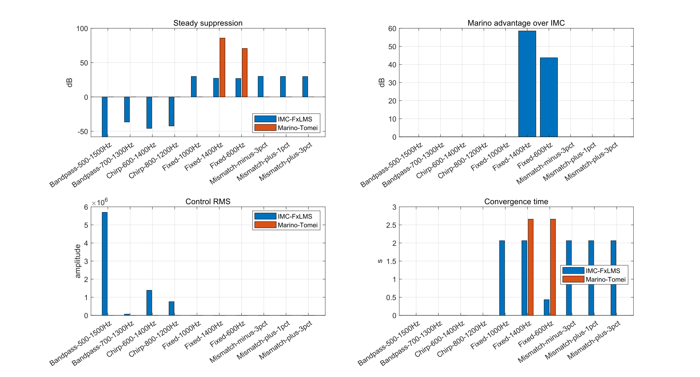
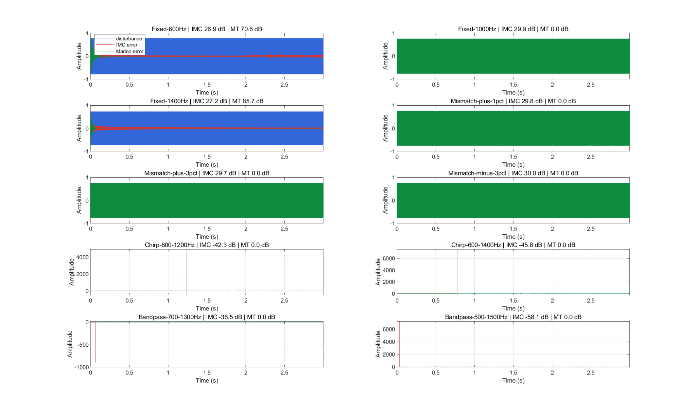

# Marino-Tomei 与 Akhtar 风格 IMC-FxLMS 对照报告

> 本报告由 `MarinoTomei_AkhtarBenchmark_compare.m` 自动生成。

## 1. 结论先行

本次 benchmark 参照 Akhtar 复现实验的场景集合与指标，比较固定参数 IMC-FxLMS baseline 和当前 demo5 中的 Marino-Tomei Case A 窄带内模实现。

- 在 Case A 条件可靠的固定单频窄带场景中，Marino-Tomei 明显优于固定参数 IMC-FxLMS baseline：`Fixed-600Hz` 提高约 43.71 dB，`Fixed-1400Hz` 提高约 58.53 dB。
- 在 Akhtar nominal `1000 Hz` 及其 mismatch 场景中，当前 Marino-Tomei Case A 不适用，因为次级路径在该频率附近 `Re(S)` 很小，`caseA ratio` 低于阈值 0.15。
- 对 chirp 和 bandlimited 场景，当前 `q=1` 的 Marino-Tomei 单振荡器不是通用 baseline；这些场景更接近 IMC-FxLMS 的适用范围，除非后续加入多内模、Case B 或更一般的相位补偿结构。
- 因此，本次结果支持的结论是：Marino-Tomei 在“少量固定窄带 + Case A 条件可靠”时有优势，但不能替代 IMC-FxLMS 作为宽带/扫频/相位不利场景的通用 ANC baseline。

**可靠性限制**：本报告沿用 Akhtar 复现实验中的固定 IMC-FxLMS 步长 `mu=0.01`，没有对 IMC-FxLMS 的 `mu`、FIR 长度或归一化策略做网格搜索。因此，表中的优势只能理解为“相对于这组固定 baseline 参数”的优势，不能理解为 Marino-Tomei 相对于调参后的最优 IMC-FxLMS 一定占优。

## 2. 图表汇总

### 2.1 指标汇总图

### 2.2 时域误差对比图

## 3. 仿真配置

| 项目 | 数值 |
| --- | --- |
| 采样率 | 10000 Hz |
| 仿真时长 | 3.00 s |
| 次级路径 | `[0 0 0.5 0.3]` |
| IMC-FxLMS 步长 | 0.01 |
| IMC-FxLMS FIR taps | 256 |
| Marino-Tomei k | 0.018 |
| Marino-Tomei epsilon | 6e-06 |
| Case A ratio 阈值 | 0.15 |

## 4. 判读规则

- `caseA ratio = min |Re(S)|/|S|`，越接近 0，越说明当前频段接近 Marino-Tomei Case A 禁区。
- `Marino advantage` 只在 IMC-FxLMS 和 Marino-Tomei 都稳定且适用时计算；否则显示 `n/a`。
- `caseA_not_applicable` 不是 Marino-Tomei 数值发散，而是脚本主动跳过当前 Case A 不可靠的场景，避免给出误导性结论。

另外，IMC-FxLMS 的表现对 `mu` 很敏感。当前报告没有声称 `mu=0.01` 是每个场景的最优值；如果要做更严格的算法优劣判断，应增加 `mu` 扫描或每场景调参后的 oracle baseline。

## 5. 完整结果表

| 场景 | 类型 | Marino 先验 Hz | Marino 末值 Hz | CaseA ratio | IMC 稳态 dB | Marino 稳态 dB | Marino 优势 dB | IMC 状态 | Marino 状态 |
| --- | --- | ---: | ---: | ---: | ---: | ---: | ---: | --- | --- |
| Fixed-600Hz | fixed | 600.0 | 600.0 | 0.626 | 26.92 | 70.63 | 43.71 | stable | stable |
| Fixed-1000Hz | fixed | 1000.0 | 1000.0 | 0.081 | 29.88 | 0.00 | n/a | stable | caseA_not_applicable |
| Fixed-1400Hz | fixed | 1400.0 | 1400.0 | 0.489 | 27.22 | 85.75 | 58.53 | stable | stable |
| Mismatch-plus-1pct | mismatch | 1000.0 | 1000.0 | 0.066 | 29.84 | 0.00 | n/a | stable | caseA_not_applicable |
| Mismatch-plus-3pct | mismatch | 1000.0 | 1000.0 | 0.037 | 29.74 | 0.00 | n/a | stable | caseA_not_applicable |
| Mismatch-minus-3pct | mismatch | 1000.0 | 1000.0 | 0.081 | 30.05 | 0.00 | n/a | stable | caseA_not_applicable |
| Chirp-800-1200Hz | chirp | 800.0 | 800.0 | 0.002 | -42.29 | 0.00 | n/a | diverged | caseA_not_applicable |
| Chirp-600-1400Hz | chirp | 600.0 | 600.0 | 0.002 | -45.80 | 0.00 | n/a | diverged | caseA_not_applicable |
| Bandpass-700-1300Hz | bandlimited | 1000.0 | 1000.0 | 0.001 | -36.51 | 0.00 | n/a | diverged | caseA_not_applicable |
| Bandpass-500-1500Hz | bandlimited | 1000.0 | 1000.0 | 0.007 | -58.06 | 0.00 | n/a | diverged | caseA_not_applicable |

## 6. 关键场景解释

### 6.1 Fixed-600Hz 与 Fixed-1400Hz

这两个场景中 `caseA ratio` 分别约为 0.626 和 0.489，说明 `Re(S)` 在目标频率处足够可靠。Marino-Tomei 能用一个自适应振荡器直接锁定并抵消单频扰动，因此稳态抑制量远高于固定参数 IMC-FxLMS。

### 6.2 Fixed-1000Hz 与 mismatch 场景

Akhtar benchmark 的 nominal 频率是 1000 Hz，但次级路径 `[0 0 0.5 0.3]` 在 1000 Hz 附近相位接近 -90 度，`Re(S)` 很小。当前 Case A 实现只使用 `sign(Re[S])`，所以这些场景被标记为 `caseA_not_applicable`。要公平比较，需要实现论文 Case B，或改成显式处理次级路径相位的 filtered-x/相位补偿结构。

### 6.3 Chirp 与 bandlimited 场景

当前 Marino-Tomei 分支只放入一个内模振荡器，适合固定或慢变单频窄带，不适合直接覆盖宽扫频或随机带限噪声。若要扩展到这些场景，需要增加多频内模、频率跟踪机制，或将 Marino-Tomei 作为窄带模块与 IMC-FxLMS 组合使用。
