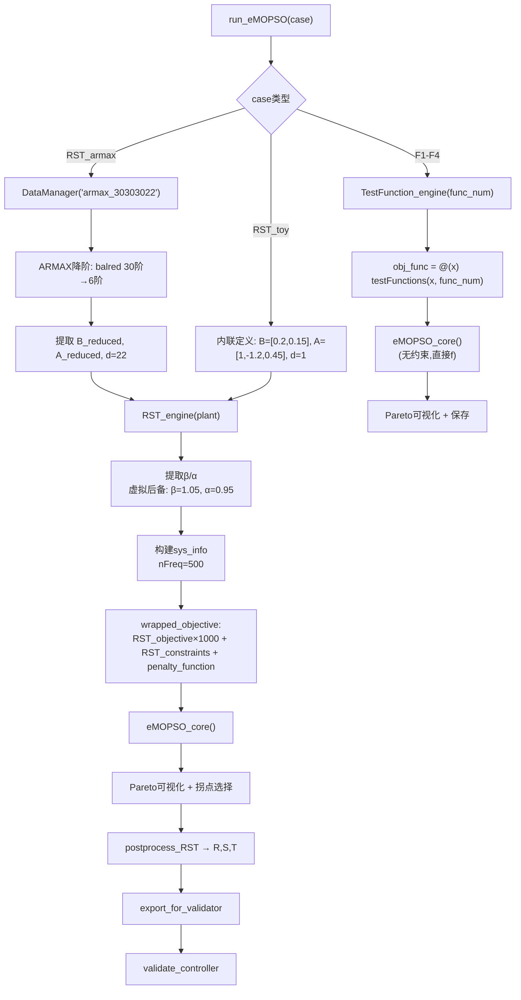

# 统一 eMOPSO 入口脚本架构设计 — `run_eMOPSO.m`

## 1. 问题域分析

`About_RST_eMOPSO_spec.md` 声明了四个标准测试函数（附录A F1-F4）以及 RST 控制器优化问题。当前 `run_RST_eMOPSO.m` 仅处理教学二阶模型，`testFunctions.m` 未被主脚本调用。需统一入口以支持全部6种问题：

| Case Key | 问题类型 | 约束 | 控制器合成 | 来源 |
|----------|---------|------|-----------|------|
| `RST_toy` | RST 控制器优化 | g1/g2 (Landau 频域模值/延迟裕度) | ✓→R,S,T | 二阶教学模型 `B=[0.2,0.15],A=[1,-1.2,0.45]` |
| `RST_armax` | RST 控制器优化 | g1/g2 | ✓→R,S,T | ARMAX(30,30,30,22) 实测声学管道 @48kHz, 需降阶 |
| `F1` | 标准测试函数 F1 | 无 | 无 | 2目标, ≥2维, Rastrigin型 |
| `F2` | 标准测试函数 F2 | 无 | 无 | 2目标, 30维, ZDT型 |
| `F3` | 标准测试函数 F3 | 无 | 无 | 3目标, 3维, 球坐标 |
| `F4` | 标准测试函数 F4 | 无 | 无 | 3目标, 3维, 正弦振荡 |

## 2. 架构总览

```
run_eMOPSO(case_key)                    ← 统一入口 (case-switch)
│
├── case {'RST_toy','RST_armax'}  →  RST_engine(plant_def)
│   ├── 1. 定义被控对象 (A,B,d,Ts)     ← RST_toy 内联 / RST_armax 加载+降阶
│   ├── 2. 提取不稳定零极点 β/α        ← 虚拟 β=1.05 / α=0.95 后备
│   ├── 3. 设定 P_D, H_R, H_S, nX, nY
│   ├── 4. 配置 ε-MOPSO 参数
│   ├── 5. 构建 sys_info + wrapped_objective(含约束惩罚)
│   ├── 6. 调用 eMOPSO_core()
│   ├── 7. Pareto 前沿可视化
│   ├── 8. 选择拐点解 (knee point)
│   ├── 9. 保存 .mat 结果
│   ├── 10. postprocess_RST() → R,S,T
│   ├── 11. export_for_validator()
│   └── 12. validate_controller()
│
├── case {'F1','F2','F3','F4'}   →  TestFunction_engine(func_num)
│   ├── 1. 根据 func_num 设置 n_var, n_obj, lb, ub
│   ├── 2. 构建 obj_func = @(x) testFunctions(x, func_num)
│   ├── 3. 配置 ε-MOPSO 参数 (无约束版本)
│   ├── 4. 调用 eMOPSO_core()  ← 直接传原始目标，无 penalty
│   ├── 5. Pareto 前沿可视化
│   └── 6. 保存 .mat 结果
│
└── otherwise  →  error() 打印可用 case 列表
```

**关键双引擎设计**：`RST_engine` 在 `wrapped_objective` 中施加约束惩罚（通过 `penalty_function`），而 `TestFunction_engine` 直接传递原始目标函数值给 `eMOPSO_core`，不涉及约束处理。

## 3. 数据流图



## 4. ARMAX 模型降阶策略

源模型: `ARMAX(30,30,30,22)` @ 48 kHz, 来自实测声学管道。

### 4.1 降阶方法
使用 MATLAB Control System Toolbox 的 `balred`（平衡截断）：
```matlab
% 1. 提取 G(z) = z^{-d} * B(z)/A(z) 并构造 ss 对象
sys_full = ss(tf(B_poly, A_poly, Ts));  % 30阶
% 2. 平衡截断到目标阶数
sys_reduced = balred(sys_full, target_order);  % 6阶
% 3. 转换回传递函数
[num, den] = tfdata(sys_reduced, 'v');
B_reduced = num;  A_reduced = den;
% 4. 重新计算 d：延迟在降阶后可能需要调整
%    balred 保留直流增益和主导动态，高频延迟特性会被近似
```

### 4.2 目标阶数选择
- **推荐 6 阶**：足够捕捉声学管道的主要共振峰（通常 2-4 个主导模态），同时保持优化问题规模可控（nX≈5, nY≈6, n_var≈11）
- 备选 4 阶：如果 6 阶模型优化过慢，可进一步降低

### 4.3 降阶后处理
- 重新计算 β/α（不稳定零/极点）从降阶后的 B_reduced, A_reduced
- d 保留原始值 22（物理声学延迟），但在高频 (48kHz) 下 d=22 对应约 0.46ms，在降采样场景下可能需要调整
- 如果降阶模型在 Nyquist 频率附近匹配较好，可直接使用

### 4.4 下采样考虑（备选）
若 `balred` 效果不佳，可将系统下采样到 1-2kHz 再设计控制器，此时 d≈1-2。公式：
```matlab
sys_ds = d2d(sys_full, 1/1000);  % 下采样到 1kHz
```

## 5. 文件变更清单

| 文件 | 操作 | 说明 |
|------|------|------|
| `demo4_Robust/run_eMOPSO.m` | **新建** | 统一入口脚本，含 case-switch + RST_engine + TestFunction_engine |
| `demo4_Robust/run_RST_eMOPSO.m` | **保留** | 向后兼容，可简化为 `run_eMOPSO('RST_toy')` 的 wrapper |
| `demo4_Robust/benchmark_MOEAs.m` | **无需改动** | 参数敏感性分析独立使用 |
| `demo4_Robust/utils/testFunctions.m` | **无需改动** | 已被 TestFunction_engine 调用 |
| `demo4_Robust/utils/eMOPSO_core.m` | **无需改动** | 核心算法不感知问题类型 |
| `demo4_Robust/utils/RST_objective.m` | **无需改动** | 已向量化 |
| `demo4_Robust/utils/RST_constraints.m` | **无需改动** | 已松弛+向量化 |
| `demo4_Robust/utils/penalty_function.m` | **无需改动** | 已修正为乘性惩罚 |
| `demo4_Robust/utils/postprocess_RST.m` | **无需改动** | 控制器合成 |
| `demo4_Robust/utils/validate_controller.m` | **无需改动** | 控制器验证 |
| `demo4_Robust/utils/export_for_validator.m` | **无需改动** | 导出工具 |

## 6. `run_eMOPSO.m` 伪代码结构

```matlab
function run_eMOPSO(case_key)
    % 路径初始化
    addpath('../functions'); addpath('./utils'); addpath('../dataset');

    switch lower(case_key)
        case {'rst_toy', 'rst_armax'}
            RST_engine(case_key);
        case {'f1', 'f2', 'f3', 'f4'}
            func_num = str2double(case_key(2));
            TestFunction_engine(func_num);
        otherwise
            print_usage();
    end
end

function RST_engine(case_key)
    % === Plant definition ===
    if strcmp(case_key, 'rst_toy')
        B = [0.2, 0.15]; A = [1, -1.2, 0.45]; d = 1; Ts = 1;
    else  % rst_armax
        [B, A, d, Ts] = load_and_reduce_armax();
    end

    % === System analysis (β/α) ===
    % === P_D, H_R, H_S, nX, nY ===
    % === eMOPSO parameters ===
    % === sys_info + wrapped_objective ===
    % === eMOPSO_core() ===
    % === Visualization + knee selection ===
    % === Save results ===
    % === Controller synthesis + export + validate ===
end

function [B, A, d, Ts] = load_and_reduce_armax()
    % DataManager → balred(30→6) → extract B,A,d,Ts
end

function TestFunction_engine(func_num)
    % === Problem dimensions ===
    % === eMOPSO parameters ===
    % === Direct objective (no constraints) ===
    % === eMOPSO_core() ===
    % === Visualization + save ===
end

function print_usage()
    % 打印可用 case 列表
end
```

## 7. RST_engine 自动化参数配置

针对不同被控对象，主导极点 P_D 和多项式阶数 nX/nY 需自适应调整：

| 参数 | RST_toy | RST_armax (降阶6阶) |
|------|---------|---------------------|
| nX | 2 | max(2, nB_red + nH_R - 2) ≈ 6 |
| nY | 3 | max(2, nA_red + nH_S - 2) ≈ 7 |
| n_var | 5 | ~13 |
| n_obj | 3 (β+delay+Bezout) | 3-5 (取决于不稳定零点数) |
| ω_P | 0.25π | 降采样后 0.15π-0.3π |
| n_pop | 40 | 60（更高维度需要更大种群） |
| k_max | 80 | 100 |
| ε | 0.02 | 0.03 |
| lb/ub | [-0.95, 0.95] | [-0.95, 0.95] |
| nFreq | 500 | 500 |

## 8. 实施步骤（TODO）

1. 新建 [`demo4_Robust/run_eMOPSO.m`](demo4_Robust/run_eMOPSO.m) 统一入口脚本
   - [ ] 实现 `run_eMOPSO(case_key)` 主分派函数
   - [ ] 实现 `RST_engine(case_key)` — 从 `run_RST_eMOPSO.m` 迁移核心逻辑
   - [ ] 实现 `load_and_reduce_armax()` — 加载 ARMAX 并降阶
   - [ ] 实现 `TestFunction_engine(func_num)` — 标准测试函数引擎
   - [ ] 实现 `print_usage()` 帮助信息
2. [ ] 更新 [`run_RST_eMOPSO.m`](demo4_Robust/run_RST_eMOPSO.m) 为 thin wrapper
3. [ ] 测试 `run_eMOPSO('RST_toy')` — 验证与现有结果一致
4. [ ] 测试 `run_eMOPSO('RST_armax')` — 验证 ARMAX 降阶+优化+控制器合成
5. [ ] 测试 `run_eMOPSO('F1')` 到 `'F4'` — 验证标准测试函数
6. [ ] 更新 [`README.md`](demo4_Robust/README.md) 使用说明
