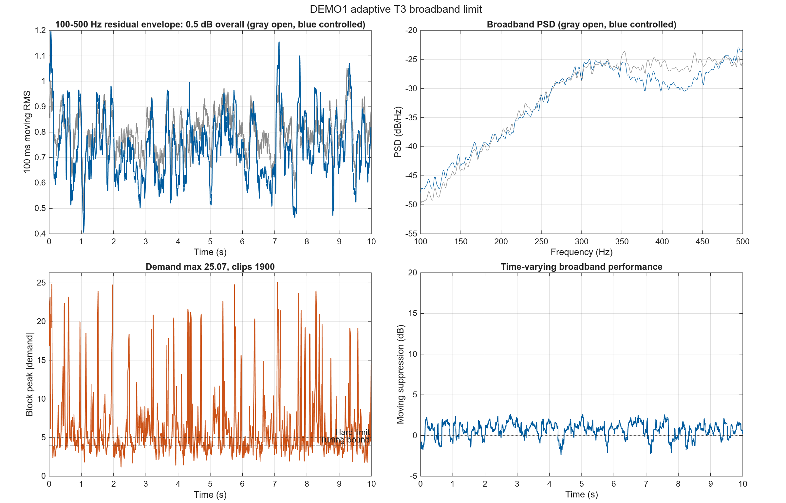
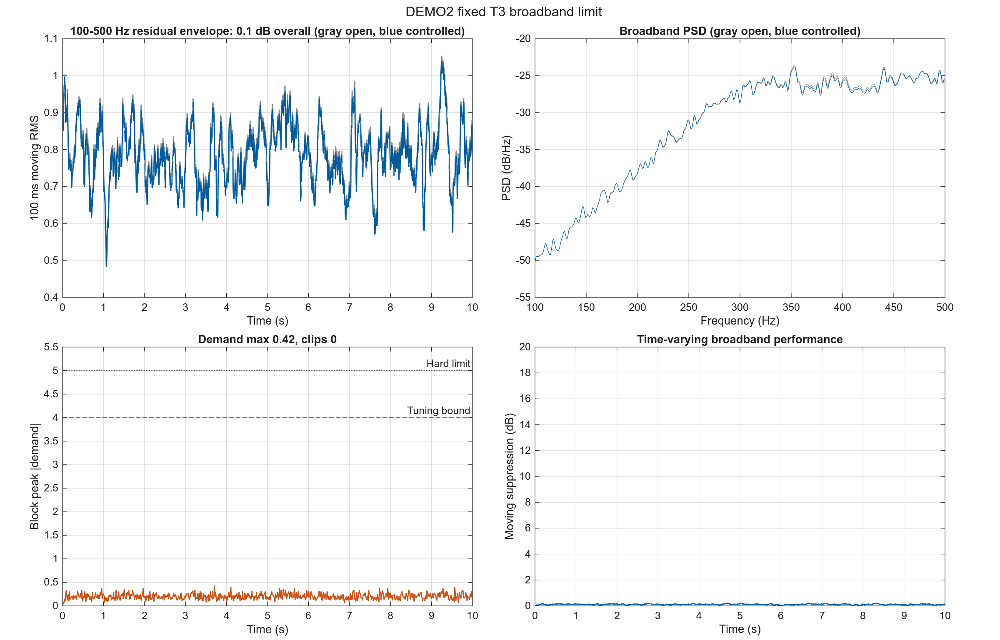
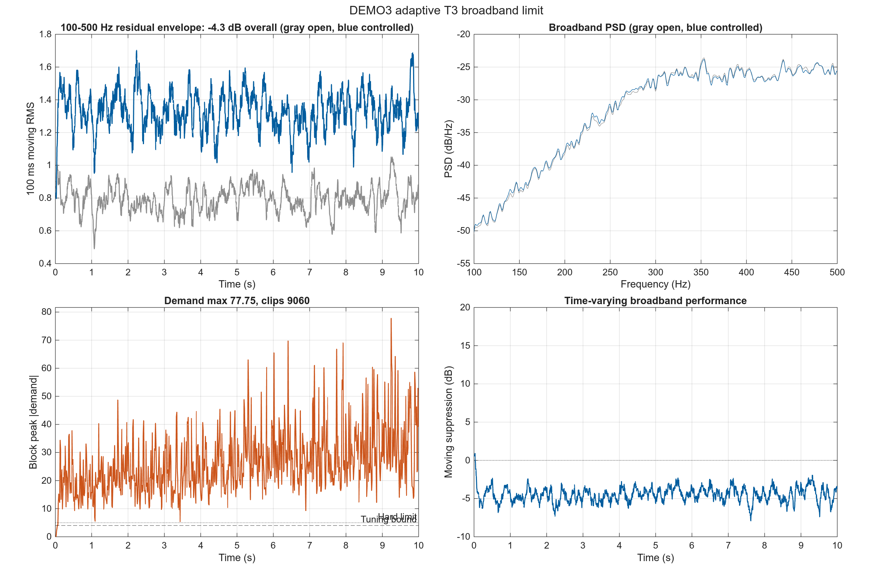
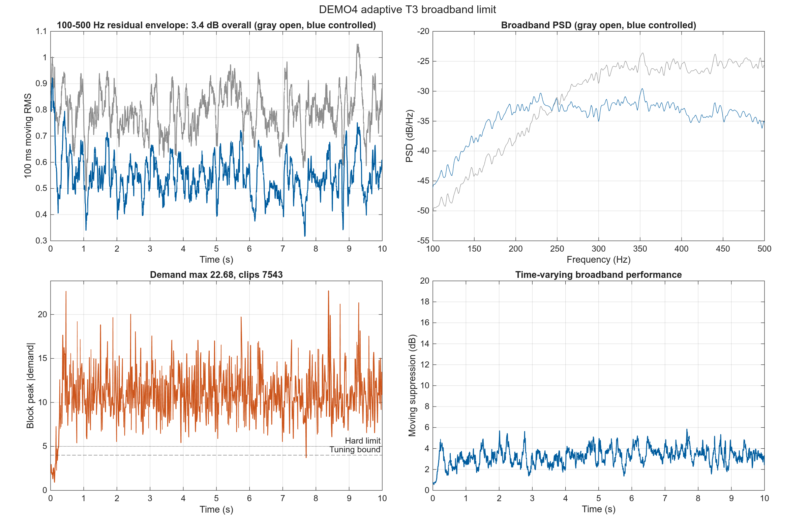

# Cylinder 1 dm 宽带控制独立边界报告

## 1. 本报告要回答什么

本报告只评估 100–500 Hz 随机宽带噪声，不参与 T1 定频与 T2 扫频的 fixed/adaptive 主比较。目的不是为四种方法排名，而是独立确认现有宽带设计是否在统一约束下有效。

成功要求为：内部稳定、评价抑制不低于 20 dB、未限幅控制需求不超过 4，且不发生硬限幅。任一条件不满足即判定无效。

## 2. 独立实验设置

| 项目 | 设置 |
|---|---|
| 场景 | T3，100–500 Hz 带限白噪声 |
| 校准/评价 | 校准 seed 42；评价 seed 142，参数冻结后评价 |
| 执行器 | 调参未限幅峰值上限 4；硬限幅 5 |
| 比较内容 | 开环/闭环 PSD、移动抑制、未限幅需求、限幅次数 |
| 主实验关系 | 与 `run_cylinder1dm_stage()` 完全分开，不改变 T1/T2 结果 |

## 3. 冻结评价摘要

| Demo | Design | Candidate | Calibration dB | Evaluation dB | Demand | Clips | Stable | Effective |
|---|---|---|---:|---:|---:|---:|---|---|
| DEMO1 | 低阶 Youla-Q RLS | q2_l098 | 0.61 | 0.53 | 25.072 | 1900 | yes | no |
| DEMO2 | 固定宽带 LQG | r_1e2 | 0.12 | 0.12 | 0.420 | 0 | yes | no |
| DEMO3 | Jafari NLMS-on-FIR | n64_mu0.01 | -4.43 | -4.32 | 77.746 | 9060 | yes | no |
| DEMO4 | eMOPSO 整形 RST + 低阶 Q-RLS | q4_l098 | 3.28 | 3.41 | 22.683 | 7543 | yes | no |

## 4. 各宽带设计的证据与结论

### DEMO1：低阶 Youla-Q RLS

**作用与目的**：检验低阶 Q 能否把窄带 RST 中央控制器扩展为宽带控制器。

**具体设置**：100–500 Hz 带限白噪声；校准与评价使用不同随机种子；候选仅在校准集选择，随后冻结到评价集。

**比较内容**：开环与闭环宽带 PSD、时变抑制、未限幅控制需求和硬限幅次数。

**图像解读**：左上移动 RMS 面板用于判断宽带抑制是否随时间保持，右上 PSD 面板用于检查 100–500 Hz 是否整体下降；本例移动抑制的中位数 0.83 dB、最小值 -2.45 dB，说明总体数值不能掩盖时变失效。左下橙色需求峰值的最大值为 25.072，并在硬限幅 1900 次的情况下与阈值 4/5 比较。橙色需求与实际控制量最大差为 20.1；差异出现的区段就是限幅压缩造成的性能风险。右下时变抑制曲线若低于 20 dB，表示对应时间窗口未达到工程成功标准。

**冻结结果**：候选 `q2_l098`；校准 0.61 dB，评价 0.53 dB；未限幅需求 25.072；限幅 1900 次；0 个候选满足调参可行性；判定为 **无效**。

当前冻结项是惩罚评分最高的失败候选，不代表已得到可行宽带控制器。

**结果解释**：抑制接近零且控制需求远超约束并触发限幅，说明当前低阶 Q 与饱和处理不足。

**本场景结论**：现有 RST/Youla 宽带设计无效。

### DEMO2：固定宽带 LQG

**作用与目的**：检验低阶随机扰动模型和固定 LQG 权重能否预测并抑制宽带实现。

**具体设置**：100–500 Hz 带限白噪声；校准与评价使用不同随机种子；候选仅在校准集选择，随后冻结到评价集。

**比较内容**：开环与闭环宽带 PSD、时变抑制、未限幅控制需求和硬限幅次数。

**图像解读**：左上移动 RMS 面板用于判断宽带抑制是否随时间保持，右上 PSD 面板用于检查 100–500 Hz 是否整体下降；本例移动抑制的中位数 0.12 dB、最小值 0.02 dB，说明总体数值不能掩盖时变失效。左下橙色需求峰值的最大值为 0.420，并在硬限幅 0 次的情况下与阈值 4/5 比较。橙色需求与实际控制量完全重合且没有硬限幅，说明该失败不是由饱和造成。右下时变抑制曲线若低于 20 dB，表示对应时间窗口未达到工程成功标准。

**冻结结果**：候选 `r_1e2`；校准 0.12 dB，评价 0.12 dB；未限幅需求 0.420；限幅 0 次；4 个候选满足调参可行性；判定为 **无效**。

**结果解释**：控制量保持很小但抑制接近零，瓶颈是随机扰动建模与权重结构，而非饱和。

**本场景结论**：现有宽带 LQG 设计无效。

### DEMO3：Jafari NLMS-on-FIR

**作用与目的**：检验增加 FIR 自由度后能否在执行器约束内实现宽带自适应。

**具体设置**：100–500 Hz 带限白噪声；校准与评价使用不同随机种子；候选仅在校准集选择，随后冻结到评价集。

**比较内容**：开环与闭环宽带 PSD、时变抑制、未限幅控制需求和硬限幅次数。

**图像解读**：左上移动 RMS 面板用于判断宽带抑制是否随时间保持，右上 PSD 面板用于检查 100–500 Hz 是否整体下降；本例移动抑制的中位数 -4.49 dB、最小值 -7.98 dB，说明总体数值不能掩盖时变失效。左下橙色需求峰值的最大值为 77.746，并在硬限幅 9060 次的情况下与阈值 4/5 比较。橙色需求与实际控制量最大差为 72.7；差异出现的区段就是限幅压缩造成的性能风险。右下时变抑制曲线若低于 20 dB，表示对应时间窗口未达到工程成功标准。

**冻结结果**：候选 `n64_mu0.01`；校准 -4.43 dB，评价 -4.32 dB；未限幅需求 77.746；限幅 9060 次；0 个候选满足调参可行性；判定为 **无效**。

当前冻结项是惩罚评分最高的失败候选，不代表已得到可行宽带控制器。

**结果解释**：评价抑制没有改善，同时未限幅需求与限幅次数均违反约束。

**本场景结论**：现有 NLMS-on-FIR 宽带设计无效。

### DEMO4：eMOPSO 整形 RST + 低阶 Q-RLS

**作用与目的**：检验多目标整形中央控制器叠加低阶 Q 后的宽带能力边界。

**具体设置**：100–500 Hz 带限白噪声；校准与评价使用不同随机种子；候选仅在校准集选择，随后冻结到评价集。

**比较内容**：开环与闭环宽带 PSD、时变抑制、未限幅控制需求和硬限幅次数。

**图像解读**：左上移动 RMS 面板用于判断宽带抑制是否随时间保持，右上 PSD 面板用于检查 100–500 Hz 是否整体下降；本例移动抑制的中位数 3.28 dB、最小值 0.53 dB，说明总体数值不能掩盖时变失效。左下橙色需求峰值的最大值为 22.683，并在硬限幅 7543 次的情况下与阈值 4/5 比较。橙色需求与实际控制量最大差为 17.7；差异出现的区段就是限幅压缩造成的性能风险。右下时变抑制曲线若低于 20 dB，表示对应时间窗口未达到工程成功标准。

**冻结结果**：候选 `q4_l098`；校准 3.28 dB，评价 3.41 dB；未限幅需求 22.683；限幅 7543 次；0 个候选满足调参可行性；判定为 **无效**。

当前冻结项是惩罚评分最高的失败候选，不代表已得到可行宽带控制器。

**结果解释**：虽有部分抑制，但依赖大幅超限控制并频繁饱和，不能视为工程有效。

**本场景结论**：现有 eMOPSO/Youla 宽带设计无效。

## 5. 总结

四种现有宽带设计均未同时满足抑制与控制约束，因此当前结论是“宽带设计无效”。该负面结论只界定 T3，不削弱 T1/T2 对窄带设计和频率跟踪能力的观察。
