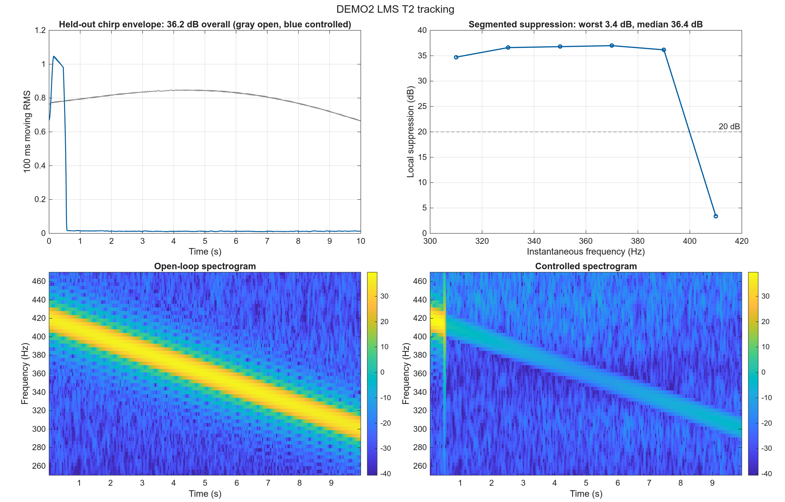
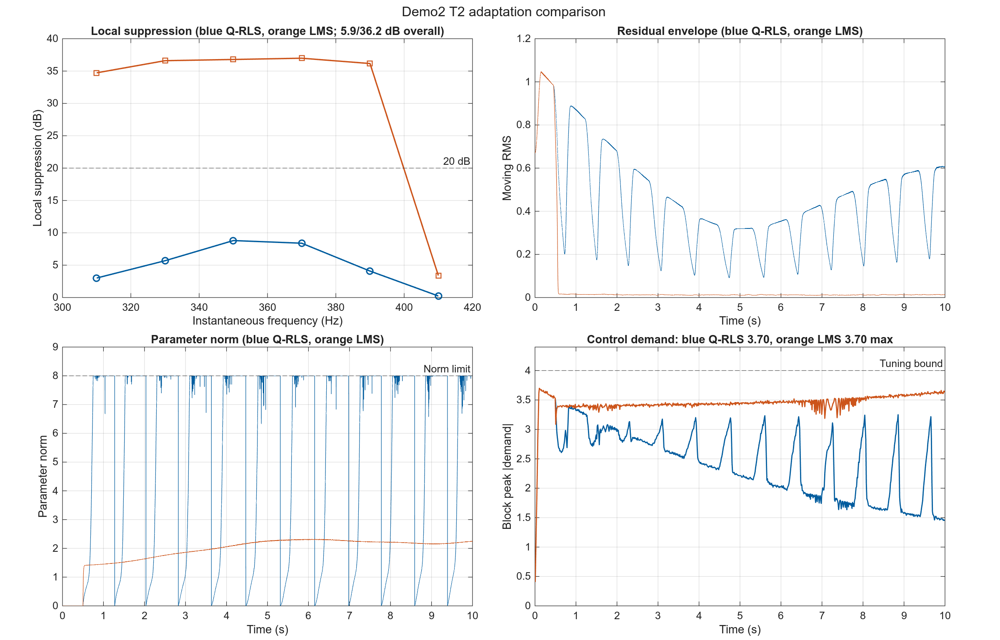

# Demo1-5 Cylinder 1 dm 阶段报告

> Demo5 离散输出时序：`updated`；所有数值结论只适用于本次冻结结果。

## 1. 阶段目标

本阶段要验证的核心命题是：**实测声学路径的 2 kHz LMS FIR 模型，是否足以支持经典控制器设计，并在未参与调参的信号上得到可解释的控制结果。**

本阶段只回答两个主问题：能否在主导频点设计控制器，以及能否适应频率漂移。100–500 Hz 宽带设计由独立阶段运行并报告，不参与本阶段的 fixed/adaptive 对比。Demo4 使用 epsilon-MOPSO 多目标灵敏度整形离线设计中央 RST，并在其上复用 Demo1 的 Youla-Q RLS 自适应律；Demo5 单列纯反馈窄带频率估计器及 IMC-FxLMS 基线，同时报告 Case A 的适用性边界。

## 2. 统一实验条件

| 条件 | 设置 | 作用 |
|---|---|---|
| 被控模型 | 主路径 LMS FIR(16)，次级路径 LMS FIR(16)，2 kHz | 验证统一测量 FIR 路径是否可直接用于设计 |
| 校准集 | 8 s，seed 42 | 仅用于选择参数，不作为最终结论 |
| 评价集 | 10 s，seed 142，T2 反向扫频 | 检查冻结参数是否能泛化到未见波形 |
| 执行器 | 硬限幅 5，调参峰值约束 4 | 防止用不可实现的大控制量换取表面抑制 |
| 成功标准 | 稳定、未限幅需求不超过 4、无饱和、至少 20 dB 抑制 | 区分“仿真运行”与“控制器设计成功” |

## 2.1 Demo5 实现核对结论

原始 `demo5_MarinoTomei` 与 `tests/internal/controller_demo5` 在同一条合成次级路径和双音设置下能够得到一致的抑制趋势，说明 Marino-Tomei 内模状态方程、反馈符号和频率自适应律本身没有失效。此前 `tests/` 与参考 Demo 的主要差异是输出时序：正式 FIR 候选曾使用 `previous`，现统一为参考 Demo 的 `updated`；`previous` 仅保留为 ARMAX 离散相位诊断。此外，可读脚本的无 stage fallback 曾回放已知无效的 adaptive 候选，现已与当前校准候选对齐。

## 3. 两种主测试分别验证什么

| 场景 | 信号设置 | 实验目的 | 主要比较 | 能回答的问题 |
|---|---|---|---|---|
| T1 定频 | 357 Hz 正弦；校准与评价使用不同相位/噪声种子 | 检查控制器能否在模型主导频点实现深抑制 | 开环与闭环波形、PSD、控制需求、稳定性 | 低阶模型是否足以完成基本控制器设计？ |
| T2 扫频 | 校准 300→420 Hz；评价 420→300 Hz | 检查偏离设计点和扫频方向变化后的跟踪能力 | 分段抑制、时频图、固定与自适应结构差异 | 控制器是否只在单一频点有效？ |

## 4. 五个 Demo 的角色与可比性

| Demo | 方法 | 信息结构 | 主要验证问题 | 重要限制 |
|---|---|---|---|---|
| Demo1 | 低阶 RST + Youla-Q RLS | 反馈与内部扰动重构 | 低阶多项式设计和慢变频率自适应是否可行 | 中央控制器窄带，Q 自由度有限 |
| Demo2 | 增广 LQG + normalized-LMS（Q-RLS 对照） | 仅输出反馈与扰动状态模型 | 最优控制和反馈自适应能否处理定频与扫频 | 边缘频段局部抑制仍低于 20 dB |
| Demo3 | F(z)+固定 FIR / IMC-FxNLMS | 源参考 + 次级路径模型 | 固定模型逆与源参考自适应是否适合定频和扫频 | 信息结构不同于 Demo1/2/4，必须单独解释 |
| Demo4 | eMOPSO 整形 RST + Youla-Q RLS | 误差输出反馈，自适应律同 Demo1 | 优化设计的中央控制器能否替代手工扫描设计并承载同款自适应 | 每个中央候选需一次完整优化，计算量大 |

| Demo5 | Marino-Tomei Case A + 纯反馈 IMC-FxLMS | 误差麦克风；前者用频率内模，后者用次级路径模型重构内部参考 | 少量窄带频率估计结构在当前离散模型上的适用性边界 | Case A 固定符号不能跨越离散有效响应零点；T1 还受控制余量限制 |

因此，横向比较关注的是“不同经典结构在各场景下表现出什么能力和限制”，而不是在完全相同信息条件下给算法排绝对名次。

## 5. 独立报告

- [Demo1](DEMO1_CYLINDER1DM_REPORT.md)
- [Demo2](DEMO2_CYLINDER1DM_REPORT.md)
- [Demo3](DEMO3_CYLINDER1DM_REPORT.md)
- [Demo4](DEMO4_CYLINDER1DM_REPORT.md)

- [Demo5](DEMO5_CYLINDER1DM_REPORT.md)

- [独立宽带边界报告](BROADBAND_CYLINDER1DM_REPORT.md)

## 6. 冻结留出结果

| Demo | Test | Variant | Suppression dB | max demand | Clips | Success |
|---|---|---|---:|---:|---:|---|
| demo1 | T1 | fixed | 27.33 | 3.179 | 0 | yes |
| demo1 | T1 | adaptive | 38.97 | 3.304 | 0 | yes |
| demo1 | T2 | adaptive | 36.58 | 3.627 | 0 | yes |
| demo2 | T1 | fixed | 36.18 | 3.310 | 0 | no |
| demo2 | T1 | adaptive | 36.59 | 3.319 | 0 | no |
| demo2 | T2 | adaptive | 36.16 | 3.699 | 0 | yes |
| demo3 | T1 | fixed | 36.72 | 3.334 | 0 | yes |
| demo3 | T1 | adaptive | 39.13 | 3.289 | 0 | yes |
| demo3 | T2 | adaptive | 23.16 | 3.589 | 0 | yes |
| demo4 | T1 | fixed | 21.94 | 3.058 | 0 | yes |
| demo4 | T1 | adaptive | 39.96 | 3.338 | 0 | yes |
| demo4 | T2 | adaptive | 38.85 | 3.730 | 0 | yes |
| demo5 | T1 | fixed | 25.75 | 3.304 | 0 | yes |
| demo5 | T1 | adaptive | 11.21 | 3.248 | 0 | no |
| demo5 | T2 | adaptive | -0.00 | 0.012 | 0 | no |
| demo5_imc | T1 | adaptive | 39.43 | 4.217 | 0 | no |
| demo5_imc | T2 | adaptive | 24.97 | 4.422 | 0 | no |

## 7. 按场景比较得到什么结论

### T1：低阶模型能否设计出有效控制器？

四种方法分别达到 27.33、36.18、36.72 和 21.94 dB，控制需求分别为 3.179、3.310、3.334 和 3.058，限幅次数分别为 0、0、0 和 0，冻结成功状态依次为 成功、失败、成功、成功。成功判断同时包含内部稳定、20 dB 抑制、未限幅需求不超过 4 和零限幅，不能只按抑制量排名。这里证明的是主导频点上的设计能力，不代表宽带能力。

Demo5 Marino-Tomei T1 为 25.75 dB，需求 3.304，限幅 0，判定为 成功；该冻结结果同时满足 20 dB、未限幅需求和零限幅标准，证明 Case A 固定窄带版本在当前测量 FIR 的 357 Hz 场景有效。

### T2：设计点附近频率变化时谁能继续工作？

Demo1 Q-RLS 为 36.58 dB（成功），Demo3 IMC-FxNLMS 为 23.16 dB（成功），Demo2 normalized-LMS 为 36.16 dB（成功），Demo4 eMOPSO 中央 + Q-RLS 为 38.85 dB（成功）。对比说明，选择与非平稳场景匹配的更新律能够显著改善缓慢频率变化下的性能；Demo2 的 Q-RLS 失败对照与 normalized-LMS 主结果说明更新律是关键解释变量；Demo1 与 Demo4 使用同一条 Q-RLS 自适应律、不同的中央控制器设计，两者的差距可直接归因于中央设计方法（手工扫描 vs 多目标优化）。

Demo5 T2 为 -0.00 dB，判定为 失败；离散有效次级响应在 300–420 Hz 内跨越零点，因此 Case A 固定符号结构不适用于整个扫频。IMC-FxLMS 基线保留在 Demo5 独立报告中，用于区分窄带内模限制与纯反馈 FIR 自适应能力。

#### Demo2 T2：Q-RLS 与 normalized-LMS 对照

该对照保持相同反馈信息、相同 LQG 基线和相同评价扫频，只替换在线参数更新律。它用于区分自适应律差异与固定中心频率模型失配，其中 normalized-LMS 是冻结主结果，Q-RLS 作为失败对照保留。

**图像解读**：收敛图用于判断更新律是否真正改变残差，控制需求图用于检查这种改善是否以超限为代价。Q-RLS 的评价总体抑制 5.88 dB、最差局部 0.24 dB；normalized-LMS 为 36.16 dB、最差局部 3.40 dB。因此 LMS 将整体性能从失效区恢复到通过区，但边缘频段仍未达到 20 dB。

| Method | Candidate | Calibration dB | Evaluation dB | Worst local dB | Demand | Clips |
|---|---|---:|---:|---:|---:|---:|
| Q-RLS | q32_l98_g15 | 3.58 | 5.88 | 0.24 | 3.699 | 0 |
| LMS | lms_n32_mu0.1 | 35.20 | 36.16 | 3.40 | 3.699 | 0 |

解释重点：normalized-LMS 恢复了总体扫频抑制，但最差局部分箱仍低于 20 dB；因此主结论是总体有效、边缘频段仍有限，而不是全频带均匀成功。

## 8. 总体结论与下一阶段

- **已验证**：低阶模型足以支持多种主导频点控制器设计；T2 的成功与失败由冻结评价表逐项给出。
- **独立边界**：100–500 Hz 宽带结论不在本阶段内，见 `BROADBAND_CYLINDER1DM_REPORT.md`。
- **比较边界**：Demo3 使用源参考，Demo1/2/4 使用反馈信息；Demo1 与 Demo4 共享同一自适应律，构成中央设计方法的受控对比。
- **下一步**：针对宽带结构与饱和感知自适应进行修正；Demo4 方向上可扩大 eMOPSO 预算、细化目标频带加权，或在选解评分中显式约束控制需求。
