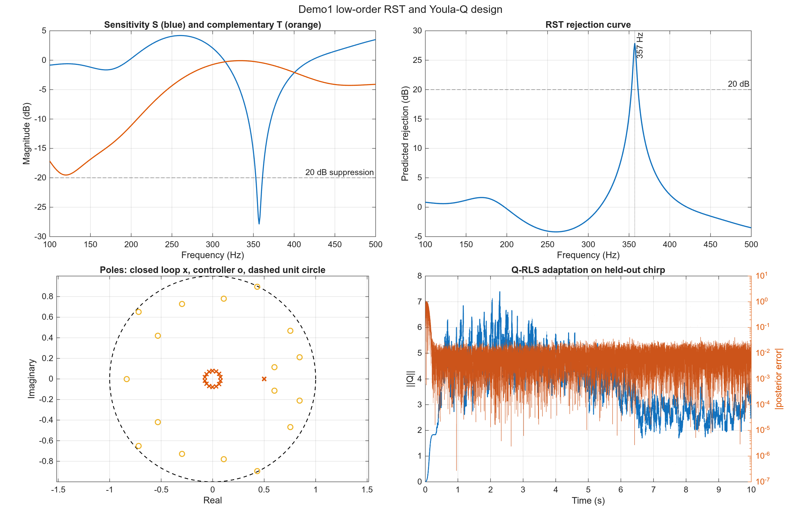
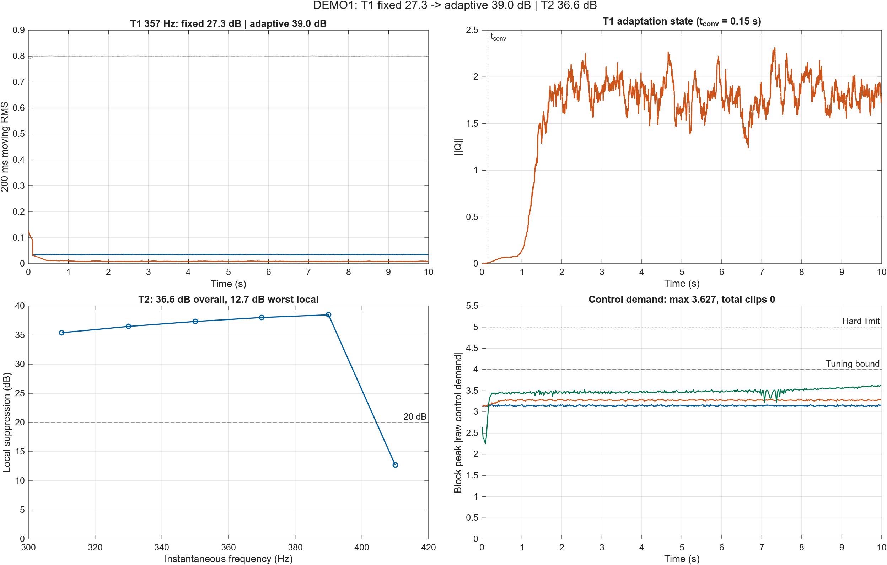
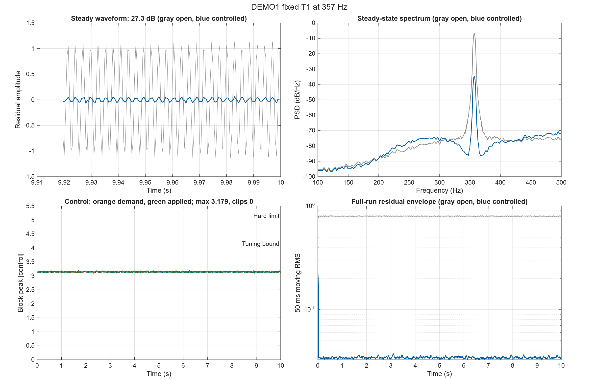
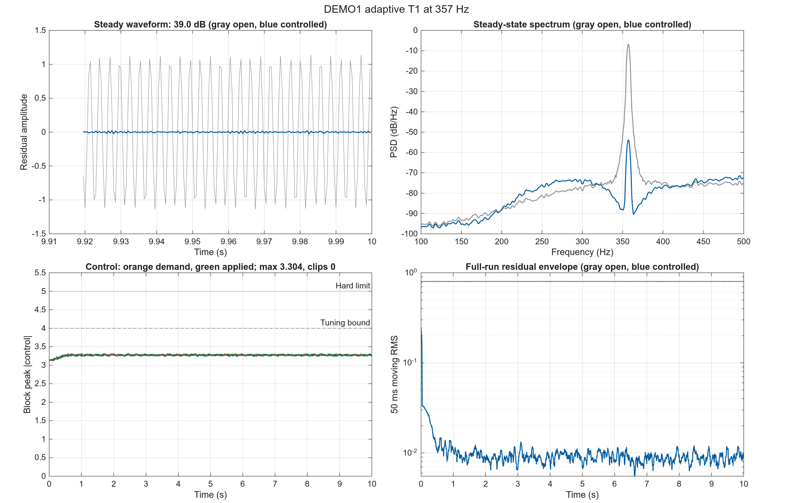
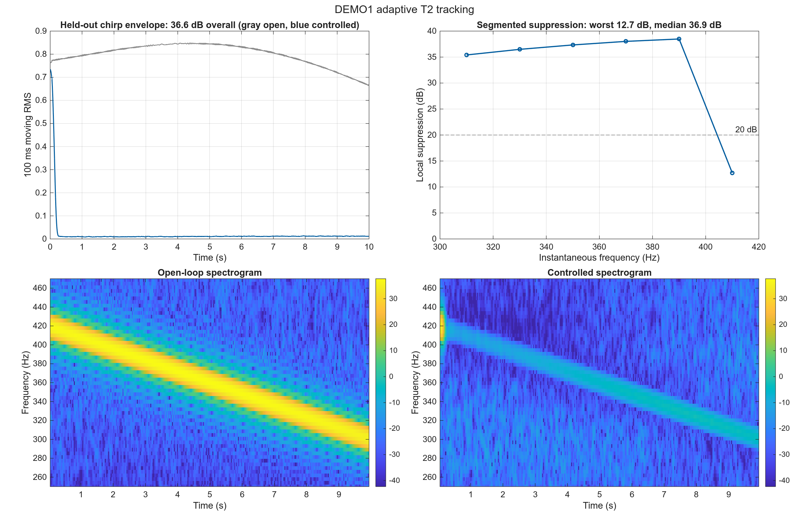

# DEMO1 Cylinder 1 dm 独立仿真报告

## 1. 本报告要回答什么

本报告面向需要判断“Cylinder 1 dm 测量 FIR 路径能否支持实际控制器设计”的控制工程读者。目标不是展示脚本能够运行，而是回答以下问题：

1. 低阶 RST 中央控制器与 Youla-Q RLS 自适应 能否在 357 Hz 主导频点形成稳定且不过载的控制器？
2. 当频率在 300–420 Hz 内缓慢变化时，该方法是否仍能维持抑制？
宽带 T3 不在本报告中，独立见 `BROADBAND_CYLINDER1DM_REPORT.md`。

性能结论只使用未参与调参的评价集。成功要求：内部稳定、未限幅控制需求不超过 4、无硬限幅，并达到至少 20 dB 抑制。

## 2. 被比较的控制方法

| 项目 | 本 Demo 设置 |
|---|---|
| 控制方法 | 低阶 RST 中央控制器与 Youla-Q RLS 自适应 |
| 信息结构 | 误差输出反馈，并由对象模型和控制输入重构扰动 |
| 主要自由度 | RST 多项式以及低阶自适应 Q 参数 |
| 预期优势 | 在指定频点形成深陷波，并通过 Q 参数跟踪有限频率变化 |
| 预期限制 | 中央 RST 为窄带设计；宽带能力在独立 T3 阶段评估 |

## 3. 为什么设置 T1、T2

| 场景 | 信号设置 | 实验目的 | 主要比较 | 能回答的问题 |
|---|---|---|---|---|
| T1 定频 | 357 Hz 正弦；校准与评价使用不同相位/噪声种子 | 检查控制器能否在模型主导频点实现深抑制 | 开环与闭环波形、PSD、控制需求、稳定性 | 低阶模型是否足以完成基本控制器设计？ |
| T2 扫频 | 校准 300→420 Hz；评价 420→300 Hz | 检查偏离设计点和扫频方向变化后的跟踪能力 | 分段抑制、时频图、固定与自适应结构差异 | 控制器是否只在单一频点有效？ |

T1 检查“能否设计”，T2 检查“偏离设计点后是否仍有效”。宽带失败边界由独立入口运行，不参与这里的 fixed/adaptive 主比较。

## 4. 独立调参过程

每个场景只在校准集上搜索参数，再把选中的参数原样运行于评价集。完整候选记录位于 `tests/output/cylinder1dm_2k/demo1234_stage/demo1234_tuning.csv`。

### T1 fixed 参数搜索

- 搜索候选：4 组；满足稳定性和控制峰值约束：4 组。
- 选中参数：`f_357`，校准集抑制 27.33 dB，未限幅需求 3.187，限幅 0 次。
- 冻结参数：`{"f_design":357}`。

### T1 adaptive 参数搜索

- 搜索候选：3 组；满足稳定性和控制峰值约束：3 组。
- 选中参数：`q2_l0995`，校准集抑制 38.98 dB，未限幅需求 3.304，限幅 0 次。
- 冻结参数：`{"nQ":2,"lambda1":0.995,"F_diag":0.001}`。

### T2 adaptive 参数搜索

- 搜索候选：4 组；满足稳定性和控制峰值约束：4 组。
- 选中参数：`q4_l098`，校准集抑制 37.95 dB，未限幅需求 3.620，限幅 0 次。
- 冻结参数：`{"nQ":4,"lambda1":0.98,"F_diag":0.001}`。

## 5. 控制器设计与稳定性分析

**图像解读**：设计图不是结果截图，而是用来检查控制器结构、稳定性和调参自由度是否解释了 T1/T2 曲线。左上/右上显示 RST 灵敏度陷波及其预测抑制 27.84 dB；闭环半径 0.5000、控制器半径 0.9944 均在单位圆内。左下 Q-RLS 范数从 0 变化到 2.79，说明自适应增量的规模；右下候选搜索中 11/11 个候选满足约束，说明当前选解不是单纯追求抑制峰值。

设计图同时展示灵敏度陷波、闭环/控制器极点，以及 T2 中 Q-RLS 参数和后验误差的变化，用于确认深抑制不是由不稳定极点造成。

## 6. 冻结评价跨场景总览

该图把三个冻结评价放在同一证据面板中：左上直接比较 T1 fixed 与 adaptive 残差，右上显示在线参数状态，左下同时给出 T2 总体和局部分箱抑制，右下用分块峰值展示未限幅控制需求及 4/5 两条约束线。

**图中结果**：T1 fixed 为 27.33 dB，adaptive 为 38.97 dB；T2 总体为 36.58 dB，但最差/中位局部分箱为 12.70/36.91 dB；三项评价的最大未限幅需求为 3.627，合计限幅 0 次。

**总览解读**：T1 adaptive 相对 fixed 提高了总体抑制；T2 最差分箱低于 20 dB，因此不能把总体 RMS 成功解释为整个 300–420 Hz 频带均匀成功。 控制需求保持在调参约束内且未发生限幅。

## 7. 各场景结果与解释

### T1：固定 RST 的基本设计能力

**作用与目的**：验证低阶多项式对象是否能直接求得稳定 RST，并在目标频点达到深抑制。

**具体设置**：357 Hz 定频正弦；校准和评价保持频率一致，但更换相位和随机噪声种子。

**比较内容**：比较开环/闭环稳态波形、357 Hz PSD 峰值、控制需求与设计稳定性。

**图像解读**：该 T1 综合图的四个面板分别回答“目标频点是否被压低、频谱峰值是否移动、控制需求是否可实现、全程是否稳定”。左上时域面板中，灰色开环扰动与蓝色闭环残差在稳态段的幅值差对应 27.33 dB 总体抑制；右上 PSD 面板应重点看 357 Hz 主峰，蓝色峰值相对灰色峰值的下降，而不是只看宽频底噪。左下控制面板中，绿色实线是实际施加量，橙色虚线是未限幅需求；两者最大差 0，限幅 0 次，本例两线重合是“需求全部可施加、没有硬限幅”的证据，不是橙色数据缺失。需求峰值 3.179，相对调参上限的余量为 0.821。右下移动 RMS 面板显示固定或快速建立后的全程残差包络；末段开环/闭环 RMS 中位数为 0.8 / 0.0343。

**冻结结果**：校准集 27.33 dB，评价集 27.33 dB；未限幅需求 3.179；限幅 0 次；判定为 **成功**。

**结果解释**：候选频点比较显示，控制器需要与该低阶模型的主导频点匹配；冻结参数在评价集保持抑制且无饱和。

**本场景结论**：低阶模型足以完成窄带 RST 控制器设计。

### T1 adaptive：定频自适应对照

**作用与目的**：在与固定 T1 相同的 357 Hz 留出信号上启用在线自适应，检查额外自由度是否改善抑制，同时保持控制需求和限幅约束。

**具体设置**：与 T1 fixed 使用相同评价信号和执行器约束；仅控制器变体切换为冻结的 adaptive 候选。

**比较内容**：与同 Demo 的 T1 fixed 结果直接比较抑制、未限幅需求和限幅次数。

**图像解读**：该 T1 综合图的四个面板分别回答“目标频点是否被压低、频谱峰值是否移动、控制需求是否可实现、全程是否稳定”。左上时域面板中，灰色开环扰动与蓝色闭环残差在稳态段的幅值差对应 38.97 dB 总体抑制；右上 PSD 面板应重点看 357 Hz 主峰，蓝色峰值相对灰色峰值的下降，而不是只看宽频底噪。左下控制面板中，绿色实线是实际施加量，橙色虚线是未限幅需求；两者最大差 0，限幅 0 次，本例两线重合是“需求全部可施加、没有硬限幅”的证据，不是橙色数据缺失。需求峰值 3.304，相对调参上限的余量为 0.696。右下移动 RMS 面板显示收敛时间约 0.150 s；末段开环/闭环 RMS 中位数为 0.8 / 0.00898。

**冻结结果**：候选 `q2_l0995`；校准集 38.98 dB，评价集 38.97 dB；未限幅需求 3.304；限幅 0 次；判定为 **成功**。

**结果解释**：相对 fixed 的 27.33 dB，adaptive 为 38.97 dB；该差异必须与控制需求 3.304 一并判断，不能只按抑制量排名。

**本场景结论**：该定频自适应候选在留出评价上满足统一成功标准。

### T2：Youla-Q RLS 的频率跟踪能力

**作用与目的**：验证固定 RST 偏离设计点后，自适应 Q 是否能补偿缓慢频率变化。

**具体设置**：校准集采用 300→420 Hz 上扫，评价集采用 420→300 Hz 下扫，避免只记住单一时间轨迹。

**比较内容**：比较全时域残差、20 Hz 分箱抑制和开闭环时频图，检查整个扫频过程而非总体 RMS。

**图像解读**：左上面板是整段留出扫频的开环/闭环 RMS 包络，用于判断总体 36.58 dB 是否由整个扫频过程贡献，而不是某个短暂频点。右上分箱曲线给出局部频率证据：最差分箱约在 410 Hz，抑制 12.70 dB，中位数 36.91 dB；1/6 个分箱低于 20 dB，因此总体通过不等于全频带均匀通过。下方两幅时频图应成对阅读：开环图显示扫频能量脊线，闭环图显示该脊线在哪些频段被压低；若闭环脊线在边缘仍清晰，就对应右上曲线中的局部失败。控制需求峰值 3.627、硬限幅 0 次，是对“频率性能改善是否可实现”的独立约束检查。

**冻结结果**：校准集 37.95 dB，评价集 36.58 dB；未限幅需求 3.627；限幅 0 次；判定为 **成功**。

**结果解释**：Q-RLS 在反向留出扫频上仍保持有效抑制，说明性能不是对校准上扫轨迹的简单复现；冻结候选在控制约束内表现最好。

**本场景结论**：Demo1 的自适应增量对有限频率漂移有效。

## 8. 冻结评价摘要

| Test | Variant | Candidate | Suppression dB | max demand | Clips | Success |
|---|---|---|---:|---:|---:|---|
| T1 | fixed | f_357 | 27.33 | 3.179 | 0 | yes |
| T1 | adaptive | q2_l0995 | 38.97 | 3.304 | 0 | yes |
| T2 | adaptive | q4_l098 | 36.58 | 3.627 | 0 | yes |

## 9. 本 Demo 最终说明了什么

- 已证明有效的场景：T1 fixed、T1 adaptive、T2 adaptive。
- Demo1 主实验检验低阶 RST 设计及 Q-RLS 扫频跟踪；宽带结论见独立 T3 报告。
- 当前默认路径是 2 kHz LMS FIR(16) 测量模型；其控制结论仍只代表该辨识路径，不能直接外推到实物系统。
