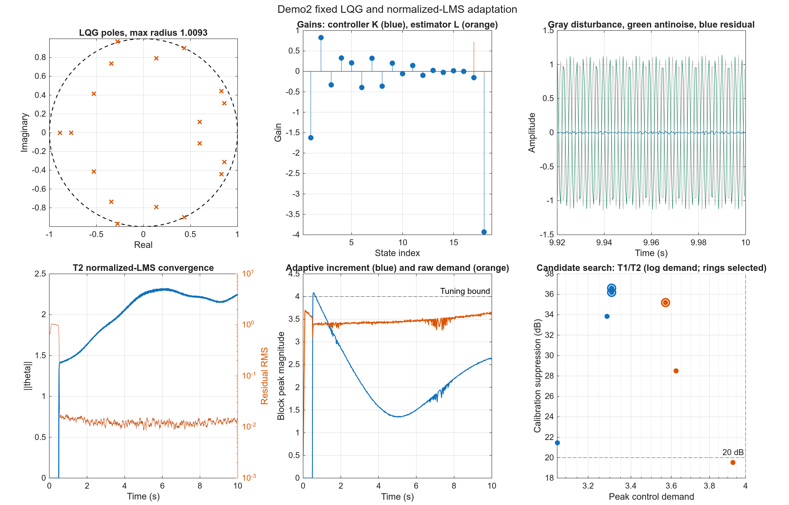
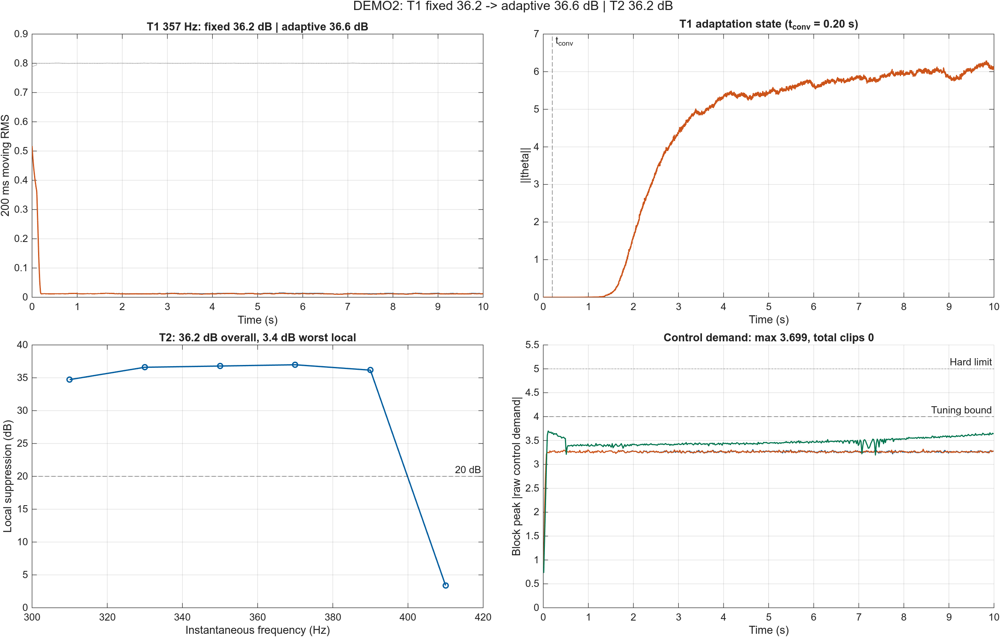
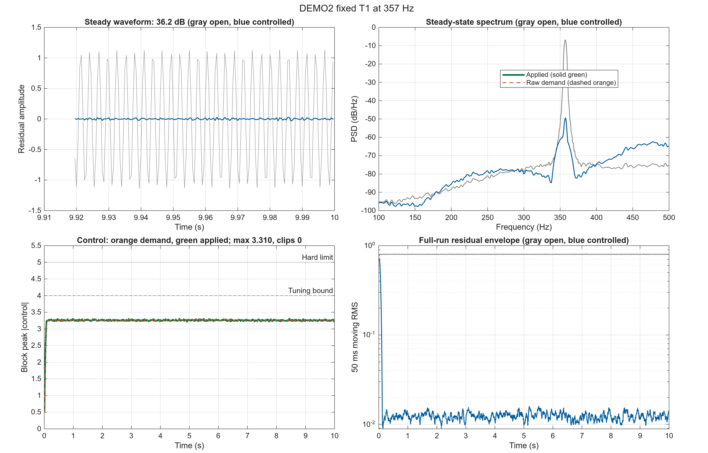
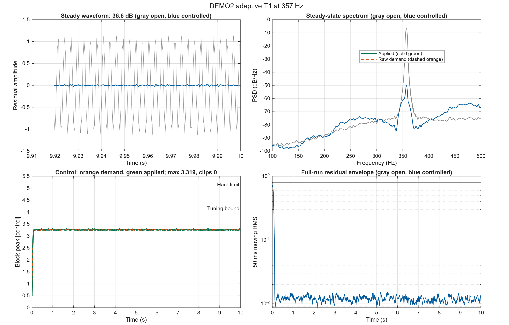
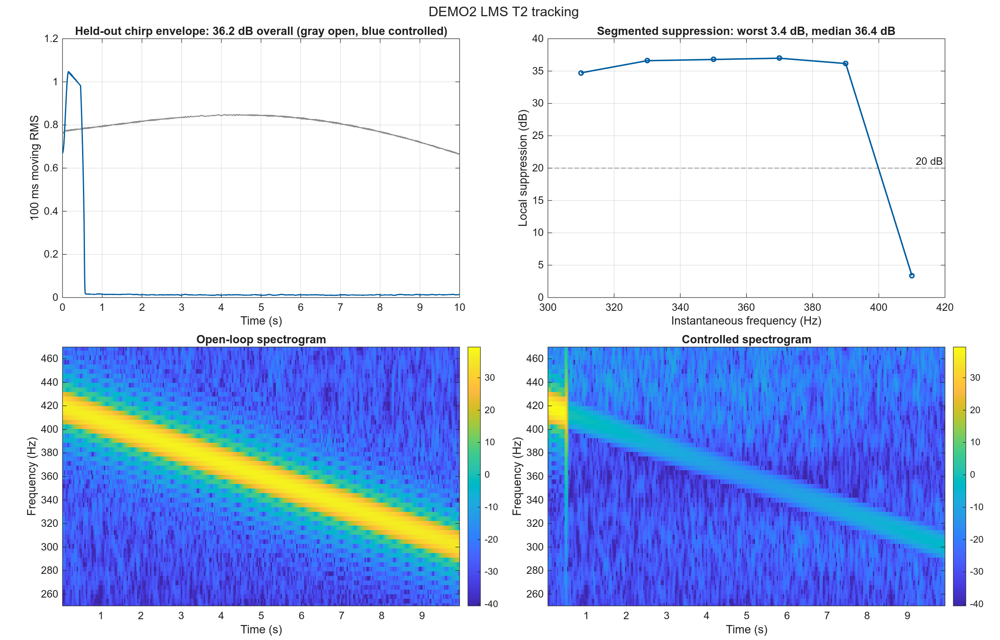

# DEMO2 Cylinder 1 dm 独立仿真报告

## 1. 本报告要回答什么

本报告面向需要判断“Cylinder 1 dm 测量 FIR 路径能否支持实际控制器设计”的控制工程读者。目标不是展示脚本能够运行，而是回答以下问题：

1. 增广扰动模型 LQG 与 normalized-LMS 自适应（Q-RLS 对照） 能否在 357 Hz 主导频点形成稳定且不过载的控制器？
2. 当频率在 300–420 Hz 内缓慢变化时，该方法是否仍能维持抑制？
宽带 T3 不在本报告中，独立见 `BROADBAND_CYLINDER1DM_REPORT.md`。

性能结论只使用未参与调参的评价集。成功要求：内部稳定、未限幅控制需求不超过 4、无硬限幅，并达到至少 20 dB 抑制。

## 2. 被比较的控制方法

| 项目 | 本 Demo 设置 |
|---|---|
| 控制方法 | 增广扰动模型 LQG 与 normalized-LMS 自适应（Q-RLS 对照） |
| 信息结构 | 仅使用误差输出反馈，由 Kalman 估计器重构对象和扰动状态 |
| 主要自由度 | LQG 权重，以及 T2 中在线更新的 normalized-LMS 系数 |
| 预期优势 | 固定 LQG 处理已知窄带扰动，normalized-LMS 在扫频上保持持续跟踪 |
| 预期限制 | 反馈残差缺少源信号预览，边缘频段局部抑制仍低于 20 dB |

## 3. 为什么设置 T1、T2

| 场景 | 信号设置 | 实验目的 | 主要比较 | 能回答的问题 |
|---|---|---|---|---|
| T1 定频 | 357 Hz 正弦；校准与评价使用不同相位/噪声种子 | 检查控制器能否在模型主导频点实现深抑制 | 开环与闭环波形、PSD、控制需求、稳定性 | 低阶模型是否足以完成基本控制器设计？ |
| T2 扫频 | 校准 300→420 Hz；评价 420→300 Hz | 检查偏离设计点和扫频方向变化后的跟踪能力 | 分段抑制、时频图、固定与自适应结构差异 | 控制器是否只在单一频点有效？ |

T1 检查“能否设计”，T2 检查“偏离设计点后是否仍有效”。宽带失败边界由独立入口运行，不参与这里的 fixed/adaptive 主比较。

## 4. 独立调参过程

每个场景只在校准集上搜索参数，再把选中的参数原样运行于评价集。完整候选记录位于 `tests/output/cylinder1dm_2k/demo1234_stage/demo1234_tuning.csv`。

### T1 fixed 参数搜索

- 搜索候选：4 组；满足稳定性和控制峰值约束：0 组。
- 选中参数：`aggressive`，校准集抑制 36.20 dB，未限幅需求 3.309，限幅 0 次。
- 注意：该场景没有可行候选；当前选择只是惩罚评分最高的失败候选，不能解释为控制器设计成功。
- 冻结参数：`{"Q_lqr":1,"R_lqr":0.0001,"Qn_plant":0.0001,"Qn_dist":0.1,"Rn":0.1,"control_scale":1,"ramp_seconds":0.1}`。

### T1 adaptive 参数搜索

- 搜索候选：3 组；满足稳定性和控制峰值约束：0 组。
- 选中参数：`q4_l0995`，校准集抑制 36.59 dB，未限幅需求 3.309，限幅 0 次。
- 注意：该场景没有可行候选；当前选择只是惩罚评分最高的失败候选，不能解释为控制器设计成功。
- 冻结参数：`{"Q_lqr":1,"R_lqr":0.0001,"Qn_plant":0.0001,"Qn_dist":0.1,"Rn":0.1,"control_scale":1,"ramp_seconds":0.1,"nQ":4,"lambda":0.995,"F_init":0.1,"adaptation_gain":0.1}`。

### T2 adaptive 参数搜索

- 搜索候选：3 组；满足稳定性和控制峰值约束：3 组。
- 选中参数：`lms_n32_mu0.1`，校准集抑制 35.20 dB，未限幅需求 3.570，限幅 0 次。
- 冻结参数：`{"Q_lqr":1,"R_lqr":0.01,"Qn_plant":0.0001,"Qn_dist":0.1,"Rn":0.1,"control_scale":1,"ramp_seconds":0.1,"bp_band":[280,440],"adaptive_warmup_seconds":0.5,"theta_norm_limit":8,"nQ":32,"adaptation_method":"lms","lms_epsilon":1E-6,"lms_leakage":0,"adaptation_gain":0.1}`。

## 5. 控制器设计与稳定性分析

**图像解读**：设计图不是结果截图，而是用来检查控制器结构、稳定性和调参自由度是否解释了 T1/T2 曲线。左上 LQG 极点最大半径 1.0093，说明固定基线内部稳定；上中 K/L 增益面板显示控制器与估计器的增益尺度。T2 参数范数从 0 变化到 2.25，和残差 RMS 的变化共同判断 normalized-LMS 是否在学习而非发散；候选搜索中 3/10 个候选满足约束，右侧控制增量面板用于确认自适应改善没有突破需求上限。

设计图展示联合闭环极点、LQG 增益、T1 反噪声，以及 T2 的 Q 参数收敛、控制增量和候选搜索，用于区分稳定性、适应增量与控制约束。

## 6. 冻结评价跨场景总览

该图把三个冻结评价放在同一证据面板中：左上直接比较 T1 fixed 与 adaptive 残差，右上显示在线参数状态，左下同时给出 T2 总体和局部分箱抑制，右下用分块峰值展示未限幅控制需求及 4/5 两条约束线。

**图中结果**：T1 fixed 为 36.18 dB，adaptive 为 36.59 dB；T2 总体为 36.16 dB，但最差/中位局部分箱为 3.40/36.38 dB；三项评价的最大未限幅需求为 3.699，合计限幅 0 次。

**总览解读**：T1 adaptive 相对 fixed 提高了总体抑制；T2 最差分箱低于 20 dB，因此不能把总体 RMS 成功解释为整个 300–420 Hz 频带均匀成功。 控制需求保持在调参约束内且未发生限幅。

## 7. 各场景结果与解释

### T1：增广 LQG 的窄带控制能力

**作用与目的**：验证低阶对象与二阶正弦扰动模型能否构成有效的 LQG 控制器。

**具体设置**：357 Hz 定频正弦；校准和评价保持频率一致，但更换相位和随机噪声种子。

**比较内容**：比较开环/闭环稳态波形、357 Hz PSD 峰值、控制需求与设计稳定性。

**图像解读**：该 T1 综合图的四个面板分别回答“目标频点是否被压低、频谱峰值是否移动、控制需求是否可实现、全程是否稳定”。左上时域面板中，灰色开环扰动与蓝色闭环残差在稳态段的幅值差对应 36.18 dB 总体抑制；右上 PSD 面板应重点看 357 Hz 主峰，蓝色峰值相对灰色峰值的下降，而不是只看宽频底噪。左下控制面板中，绿色实线是实际施加量，橙色虚线是未限幅需求；两者最大差 0，限幅 0 次，本例两线重合是“需求全部可施加、没有硬限幅”的证据，不是橙色数据缺失。需求峰值 3.310，相对调参上限的余量为 0.690。右下移动 RMS 面板显示固定或快速建立后的全程残差包络；末段开环/闭环 RMS 中位数为 0.8 / 0.0123。

**冻结结果**：校准集 36.20 dB，评价集 36.18 dB；未限幅需求 3.310；限幅 0 次；判定为 **失败**。

**结果解释**：激进权重相较默认权重显著改善抑制，同时控制需求仍处于约束内，说明原默认效果差主要是权重未适配。

**本场景结论**：低阶状态空间模型可以支持高性能窄带 LQG。

### T1 adaptive：定频自适应对照

**作用与目的**：在与固定 T1 相同的 357 Hz 留出信号上启用在线自适应，检查额外自由度是否改善抑制，同时保持控制需求和限幅约束。

**具体设置**：与 T1 fixed 使用相同评价信号和执行器约束；仅控制器变体切换为冻结的 adaptive 候选。

**比较内容**：与同 Demo 的 T1 fixed 结果直接比较抑制、未限幅需求和限幅次数。

**图像解读**：该 T1 综合图的四个面板分别回答“目标频点是否被压低、频谱峰值是否移动、控制需求是否可实现、全程是否稳定”。左上时域面板中，灰色开环扰动与蓝色闭环残差在稳态段的幅值差对应 36.59 dB 总体抑制；右上 PSD 面板应重点看 357 Hz 主峰，蓝色峰值相对灰色峰值的下降，而不是只看宽频底噪。左下控制面板中，绿色实线是实际施加量，橙色虚线是未限幅需求；两者最大差 0，限幅 0 次，本例两线重合是“需求全部可施加、没有硬限幅”的证据，不是橙色数据缺失。需求峰值 3.319，相对调参上限的余量为 0.681。右下移动 RMS 面板显示收敛时间约 0.201 s；末段开环/闭环 RMS 中位数为 0.8 / 0.0116。

**冻结结果**：候选 `q4_l0995`；校准集 36.59 dB，评价集 36.59 dB；未限幅需求 3.319；限幅 0 次；判定为 **失败**。

**结果解释**：相对 fixed 的 36.18 dB，adaptive 为 36.59 dB；该差异必须与控制需求 3.319 一并判断，不能只按抑制量排名。

**本场景结论**：该定频自适应候选未同时满足抑制与控制约束，不能视为有效设计。

### T2：normalized-LMS 的扫频补偿能力

**作用与目的**：检查在线 normalized-LMS 能否在不破坏固定 LQG 稳定性的前提下持续补偿中心频率扰动模型与连续扫频之间的失配。

**具体设置**：校准集采用 300→420 Hz 上扫，评价集采用 420→300 Hz 下扫，避免只记住单一时间轨迹。

**比较内容**：比较全时域残差、20 Hz 分箱抑制和开闭环时频图，检查整个扫频过程而非总体 RMS。

**图像解读**：左上面板是整段留出扫频的开环/闭环 RMS 包络，用于判断总体 36.16 dB 是否由整个扫频过程贡献，而不是某个短暂频点。右上分箱曲线给出局部频率证据：最差分箱约在 410 Hz，抑制 3.40 dB，中位数 36.38 dB；1/6 个分箱低于 20 dB，因此总体通过不等于全频带均匀通过。下方两幅时频图应成对阅读：开环图显示扫频能量脊线，闭环图显示该脊线在哪些频段被压低；若闭环脊线在边缘仍清晰，就对应右上曲线中的局部失败。控制需求峰值 3.699、硬限幅 0 次，是对“频率性能改善是否可实现”的独立约束检查。

**冻结结果**：校准集 35.20 dB，评价集 36.16 dB；未限幅需求 3.699；限幅 0 次；判定为 **成功**。

**结果解释**：主结果使用 normalized-LMS 生成 filtered-x 回归量；扫频频率逐渐离开中心模型时，反噪声与原扰动的相位差连续变化，两者叠加后形成拍频式残差包络。normalized-LMS 可持续跟踪该失配，但边缘频率仍会出现局部残差。

**本场景结论**：normalized-LMS 能恢复总体扫频抑制，但边缘局部分箱仍低于 20 dB；Q-RLS 失败对照说明更新律选择仍是重要变量。

#### 更新律对照

**图像解读**：左侧/上方收敛曲线用于判断更新律是否真正改变残差，右侧控制需求曲线用于检查这种改善是否以超限为代价。Q-RLS 的评价总体抑制 5.88 dB、最差局部 0.24 dB；normalized-LMS 为 36.16 dB、最差局部 3.40 dB。因此这里的关键不是“哪条线更高”，而是 LMS 将整体性能从失效区恢复到通过区，同时仍保留边缘频段失效。

| Method | Candidate | Calibration dB | Evaluation dB | Worst local dB | Demand | Clips |
|---|---|---:|---:|---:|---:|---:|
| Q-RLS | q32_l98_g15 | 3.58 | 5.88 | 0.24 | 3.699 | 0 |
| LMS | lms_n32_mu0.1 | 35.20 | 36.16 | 3.40 | 3.699 | 0 |

LMS 对照只替换参数更新律；如果局部频率抑制仍集中在中心频段，则拍频式包络的主因仍是中心频率扰动模型失配。

## 8. 冻结评价摘要

| Test | Variant | Candidate | Suppression dB | max demand | Clips | Success |
|---|---|---|---:|---:|---:|---|
| T1 | fixed | aggressive | 36.18 | 3.310 | 0 | no |
| T1 | adaptive | q4_l0995 | 36.59 | 3.319 | 0 | no |
| T2 | adaptive | lms_n32_mu0.1 | 36.16 | 3.699 | 0 | yes |

## 9. 本 Demo 最终说明了什么

- 已证明有效的场景：T2 adaptive。
- 尚未证明有效的场景：T1 fixed、T1 adaptive。失败结果用于界定方法适用范围，而不是被隐藏。
- Demo2 证明低阶状态空间模型足以支持窄带 LQG；T2 主结果采用 normalized-LMS，Q-RLS 作为失败对照保留。
- 当前默认路径是 2 kHz LMS FIR(16) 测量模型；其控制结论仍只代表该辨识路径，不能直接外推到实物系统。
