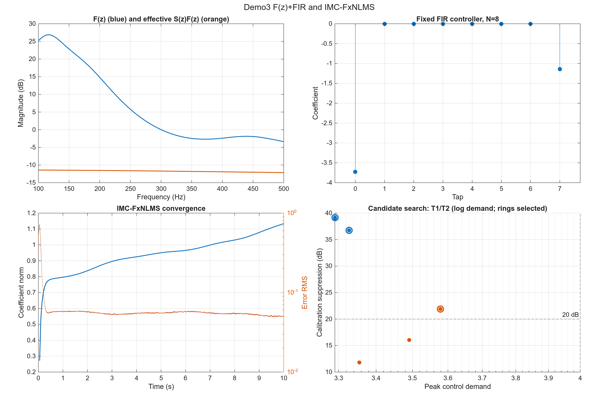
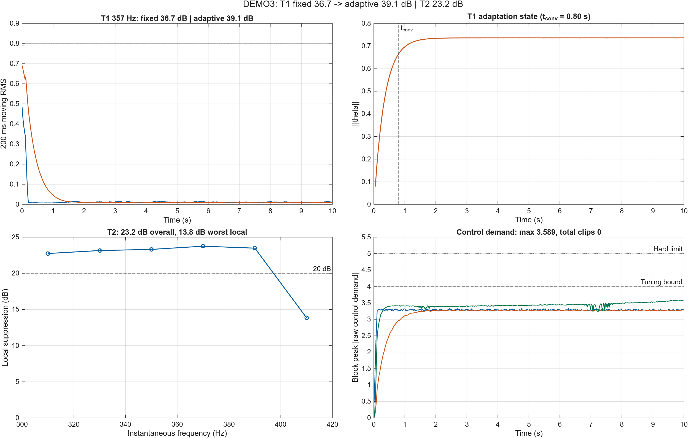
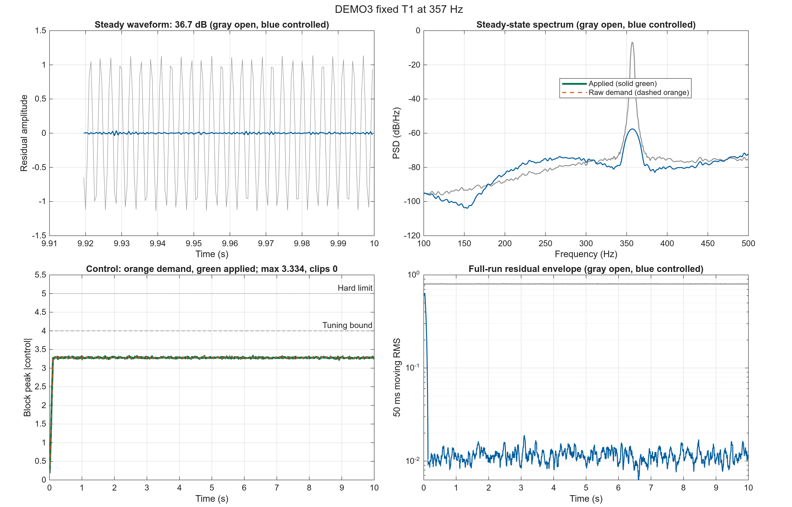
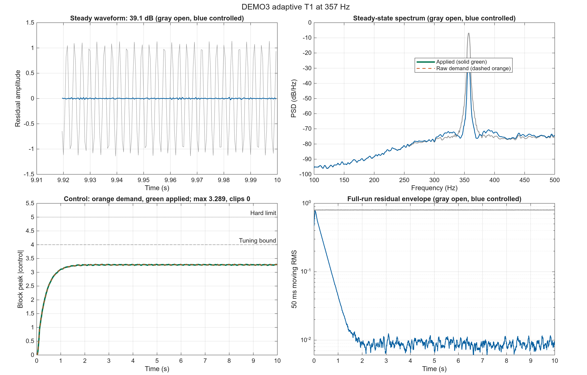
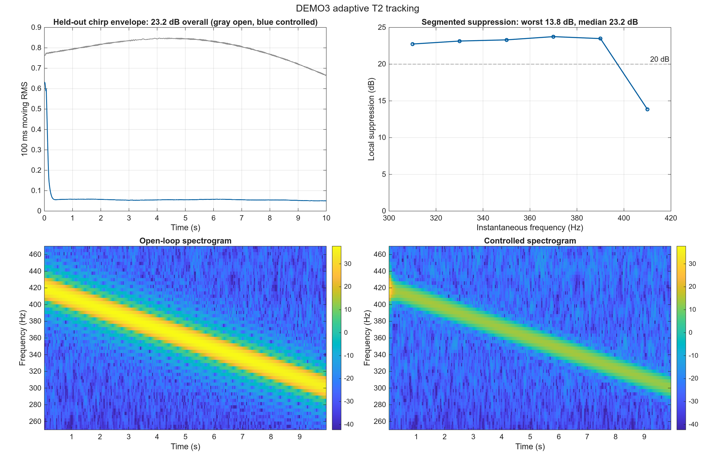

# DEMO3 Cylinder 1 dm 独立仿真报告

## 1. 本报告要回答什么

本报告面向需要判断“Cylinder 1 dm 测量 FIR 路径能否支持实际控制器设计”的控制工程读者。目标不是展示脚本能够运行，而是回答以下问题：

1. F(z)+固定 FIR 与 IMC-FxNLMS 自适应基线 能否在 357 Hz 主导频点形成稳定且不过载的控制器？
2. 当频率在 300–420 Hz 内缓慢变化时，该方法是否仍能维持抑制？
宽带 T3 不在本报告中，独立见 `BROADBAND_CYLINDER1DM_REPORT.md`。

性能结论只使用未参与调参的评价集。成功要求：内部稳定、未限幅控制需求不超过 4、无硬限幅，并达到至少 20 dB 抑制。

## 2. 被比较的控制方法

| 项目 | 本 Demo 设置 |
|---|---|
| 控制方法 | F(z)+固定 FIR 与 IMC-FxNLMS 自适应基线 |
| 信息结构 | 使用主噪声源参考信号，并使用次级路径模型进行 filtered-x 更新 |
| 主要自由度 | 固定 FIR tap 或在线自适应 FIR 系数 |
| 预期优势 | 源参考和次级路径 filtered-x 更新适合定频及有限扫频跟踪 |
| 预期限制 | IMC-FxNLMS 与 Jafari F(z) 自适应结构不同，局部频段仍可能失效 |

## 3. 为什么设置 T1、T2

| 场景 | 信号设置 | 实验目的 | 主要比较 | 能回答的问题 |
|---|---|---|---|---|
| T1 定频 | 357 Hz 正弦；校准与评价使用不同相位/噪声种子 | 检查控制器能否在模型主导频点实现深抑制 | 开环与闭环波形、PSD、控制需求、稳定性 | 低阶模型是否足以完成基本控制器设计？ |
| T2 扫频 | 校准 300→420 Hz；评价 420→300 Hz | 检查偏离设计点和扫频方向变化后的跟踪能力 | 分段抑制、时频图、固定与自适应结构差异 | 控制器是否只在单一频点有效？ |

T1 检查“能否设计”，T2 检查“偏离设计点后是否仍有效”。宽带失败边界由独立入口运行，不参与这里的 fixed/adaptive 主比较。

## 4. 独立调参过程

每个场景只在校准集上搜索参数，再把选中的参数原样运行于评价集。完整候选记录位于 `tests/output/cylinder1dm_2k/demo1234_stage/demo1234_tuning.csv`。

### T1 fixed 参数搜索

- 搜索候选：3 组；满足稳定性和控制峰值约束：3 组。
- 选中参数：`fir8`，校准集抑制 36.72 dB，未限幅需求 3.327，限幅 0 次。
- 冻结参数：`{"N_fir":8,"f_design":357}`。

### T1 adaptive 参数搜索

- 搜索候选：3 组；满足稳定性和控制峰值约束：3 组。
- 选中参数：`imc_n32_mu0.003`，校准集抑制 39.14 dB，未限幅需求 3.290，限幅 0 次。
- 冻结参数：`{"N_fir":8,"N_nlms":32,"mu_nlms":0.003,"f_design":357,"adaptive_structure":"imc_fxnlms","theta_norm_limit":10}`。

### T2 adaptive 参数搜索

- 搜索候选：3 组；满足稳定性和控制峰值约束：3 组。
- 选中参数：`imc_n32_mu0.01`，校准集抑制 21.88 dB，未限幅需求 3.578，限幅 0 次。
- 冻结参数：`{"N_fir":8,"N_nlms":32,"mu_nlms":0.01,"f_design":357,"adaptive_structure":"imc_fxnlms","theta_norm_limit":10}`。

## 5. 控制器设计与稳定性分析

**图像解读**：设计图不是结果截图，而是用来检查控制器结构、稳定性和调参自由度是否解释了 T1/T2 曲线。左上 F(z) 展平后的幅值在设计频带内由 -3.36 到 26.88 dB，有效次级通道在 357 Hz 为 -11.82 dB；右上固定 FIR 的 tap 范围为 [-3.73, 0]，范数 3.9；左下 IMC-FxNLMS 系数范数末值 1.13，右下 9/9 个候选满足约束。

设计图展示 F(z) 展平、固定 FIR 系数、IMC-FxNLMS 系数收敛和 T1/T2 参数搜索，用于解释固定与自适应结果的差异。

## 6. 冻结评价跨场景总览

该图把三个冻结评价放在同一证据面板中：左上直接比较 T1 fixed 与 adaptive 残差，右上显示在线参数状态，左下同时给出 T2 总体和局部分箱抑制，右下用分块峰值展示未限幅控制需求及 4/5 两条约束线。

**图中结果**：T1 fixed 为 36.72 dB，adaptive 为 39.13 dB；T2 总体为 23.16 dB，但最差/中位局部分箱为 13.85/23.23 dB；三项评价的最大未限幅需求为 3.589，合计限幅 0 次。

**总览解读**：T1 adaptive 相对 fixed 提高了总体抑制；T2 最差分箱低于 20 dB，因此不能把总体 RMS 成功解释为整个 300–420 Hz 频带均匀成功。 控制需求保持在调参约束内且未发生限幅。

## 7. 各场景结果与解释

### T1：F(z)+固定 FIR 的模型逆设计能力

**作用与目的**：验证低阶次级路径模型是否足以设计一个因果 FIR，在主导频点产生幅相匹配的反噪声。

**具体设置**：357 Hz 定频正弦；校准和评价保持频率一致，但更换相位和随机噪声种子。

**比较内容**：比较开环/闭环稳态波形、357 Hz PSD 峰值、控制需求与设计稳定性。

**图像解读**：该 T1 综合图的四个面板分别回答“目标频点是否被压低、频谱峰值是否移动、控制需求是否可实现、全程是否稳定”。左上时域面板中，灰色开环扰动与蓝色闭环残差在稳态段的幅值差对应 36.72 dB 总体抑制；右上 PSD 面板应重点看 357 Hz 主峰，蓝色峰值相对灰色峰值的下降，而不是只看宽频底噪。左下控制面板中，绿色实线是实际施加量，橙色虚线是未限幅需求；两者最大差 0，限幅 0 次，本例两线重合是“需求全部可施加、没有硬限幅”的证据，不是橙色数据缺失。需求峰值 3.334，相对调参上限的余量为 0.666。右下移动 RMS 面板显示固定或快速建立后的全程残差包络；末段开环/闭环 RMS 中位数为 0.8 / 0.0114。

**冻结结果**：校准集 36.72 dB，评价集 36.72 dB；未限幅需求 3.334；限幅 0 次；判定为 **成功**。

**结果解释**：不同 FIR 阶数候选的性能接近，最终选择最简单的候选；这说明更高阶 FIR 并非该定频场景的必要条件。

**本场景结论**：低阶次级路径模型足以支持紧凑的固定 FIR 设计。

### T1 adaptive：定频自适应对照

**作用与目的**：在与固定 T1 相同的 357 Hz 留出信号上启用在线自适应，检查额外自由度是否改善抑制，同时保持控制需求和限幅约束。

**具体设置**：与 T1 fixed 使用相同评价信号和执行器约束；仅控制器变体切换为冻结的 adaptive 候选。

**比较内容**：与同 Demo 的 T1 fixed 结果直接比较抑制、未限幅需求和限幅次数。

**图像解读**：该 T1 综合图的四个面板分别回答“目标频点是否被压低、频谱峰值是否移动、控制需求是否可实现、全程是否稳定”。左上时域面板中，灰色开环扰动与蓝色闭环残差在稳态段的幅值差对应 39.13 dB 总体抑制；右上 PSD 面板应重点看 357 Hz 主峰，蓝色峰值相对灰色峰值的下降，而不是只看宽频底噪。左下控制面板中，绿色实线是实际施加量，橙色虚线是未限幅需求；两者最大差 0，限幅 0 次，本例两线重合是“需求全部可施加、没有硬限幅”的证据，不是橙色数据缺失。需求峰值 3.289，相对调参上限的余量为 0.711。右下移动 RMS 面板显示收敛时间约 0.800 s；末段开环/闭环 RMS 中位数为 0.8 / 0.00873。

**冻结结果**：候选 `imc_n32_mu0.003`；校准集 39.14 dB，评价集 39.13 dB；未限幅需求 3.289；限幅 0 次；判定为 **成功**。

**结果解释**：相对 fixed 的 36.72 dB，adaptive 为 39.13 dB；该差异必须与控制需求 3.289 一并判断，不能只按抑制量排名。

**本场景结论**：该定频自适应候选在留出评价上满足统一成功标准。

### T2：IMC-FxNLMS 的扫频跟踪能力

**作用与目的**：验证具有源参考和次级路径估计的前馈自适应滤波器能否跟踪频率变化。

**具体设置**：校准集采用 300→420 Hz 上扫，评价集采用 420→300 Hz 下扫，避免只记住单一时间轨迹。

**比较内容**：比较全时域残差、20 Hz 分箱抑制和开闭环时频图，检查整个扫频过程而非总体 RMS。

**图像解读**：左上面板是整段留出扫频的开环/闭环 RMS 包络，用于判断总体 23.16 dB 是否由整个扫频过程贡献，而不是某个短暂频点。右上分箱曲线给出局部频率证据：最差分箱约在 410 Hz，抑制 13.85 dB，中位数 23.23 dB；1/6 个分箱低于 20 dB，因此总体通过不等于全频带均匀通过。下方两幅时频图应成对阅读：开环图显示扫频能量脊线，闭环图显示该脊线在哪些频段被压低；若闭环脊线在边缘仍清晰，就对应右上曲线中的局部失败。控制需求峰值 3.589、硬限幅 0 次，是对“频率性能改善是否可实现”的独立约束检查。

**冻结结果**：校准集 21.88 dB，评价集 23.16 dB；未限幅需求 3.589；限幅 0 次；判定为 **成功**。

**结果解释**：冻结 IMC-FxNLMS 候选在评价下扫中达到总体成功阈值且无饱和；分段曲线显示边缘频段仍低于 20 dB，因此结论限定为有限频带有效。

**本场景结论**：IMC-FxNLMS 在总体指标上达到 20 dB，但最差局部分箱仍低于 20 dB，结论限定为有限频带有效。

## 8. 冻结评价摘要

| Test | Variant | Candidate | Suppression dB | max demand | Clips | Success |
|---|---|---|---:|---:|---:|---|
| T1 | fixed | fir8 | 36.72 | 3.334 | 0 | yes |
| T1 | adaptive | imc_n32_mu0.003 | 39.13 | 3.289 | 0 | yes |
| T2 | adaptive | imc_n32_mu0.01 | 23.16 | 3.589 | 0 | yes |

## 9. 本 Demo 最终说明了什么

- 已证明有效的场景：T1 fixed、T1 adaptive、T2 adaptive。
- Demo3 主实验采用固定 F(z)+FIR 与 IMC-FxNLMS；原 Jafari 回归量的失败边界见独立 T3 结果。
- 当前默认路径是 2 kHz LMS FIR(16) 测量模型；其控制结论仍只代表该辨识路径，不能直接外推到实物系统。
