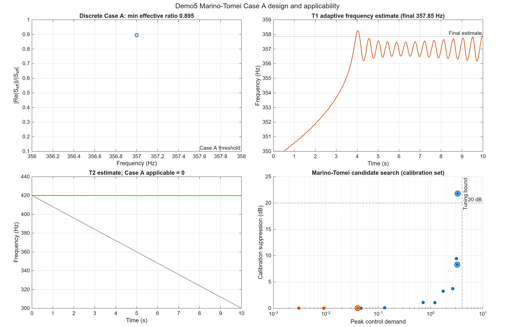
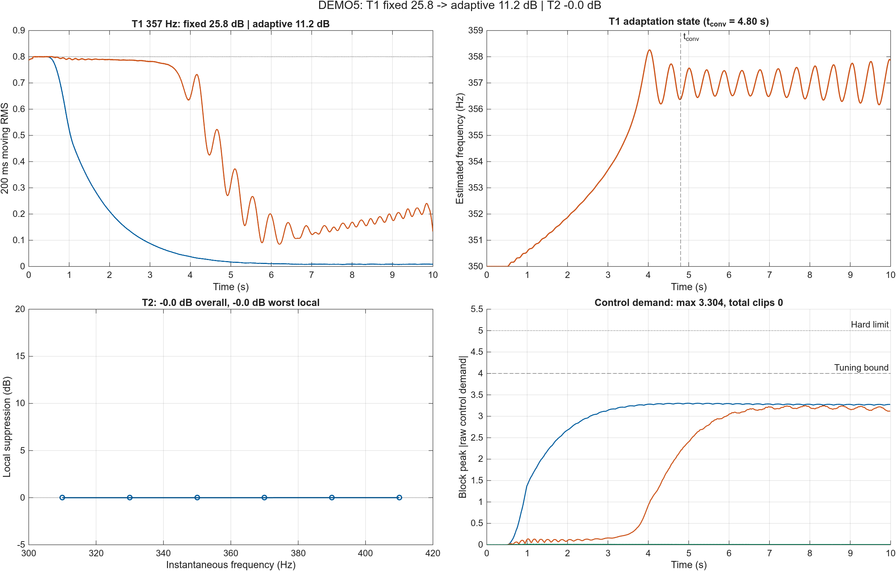
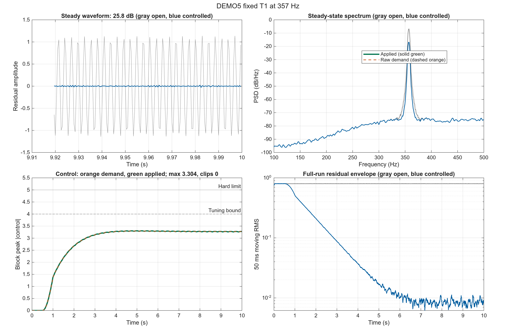
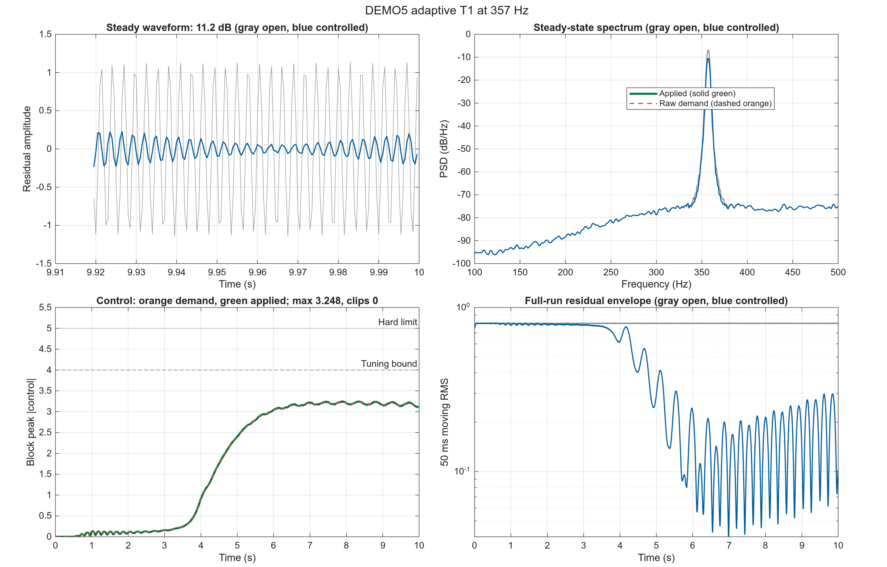
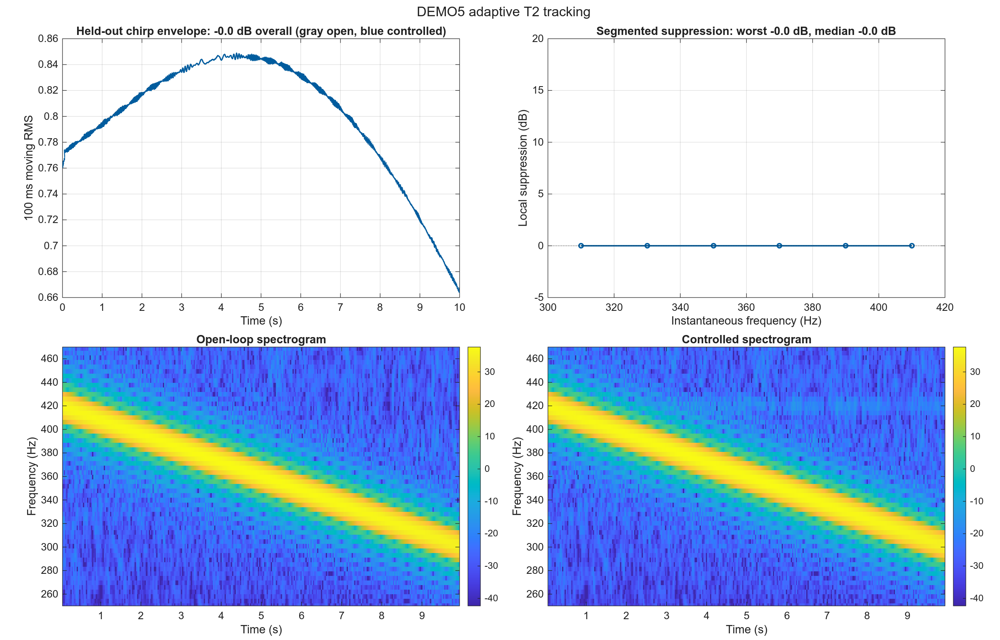

# DEMO5 Cylinder 1 dm 独立仿真报告

> 离散输出时序：`updated`。本报告只解释当前冻结结果，不能与其他时序生成的旧 CSV/MAT 混用。

## 1. 本报告要回答什么

本报告面向需要判断“Cylinder 1 dm 测量 FIR 路径能否支持实际控制器设计”的控制工程读者。目标不是展示脚本能够运行，而是回答以下问题：

1. Marino-Tomei 自适应频率估计器与纯反馈 IMC-FxLMS 对照 能否在 357 Hz 主导频点形成稳定且不过载的控制器？
2. 当频率在 300–420 Hz 内缓慢变化时，该方法是否仍能维持抑制？
宽带 T3 不在本报告中，独立见 `BROADBAND_CYLINDER1DM_REPORT.md`。

性能结论只使用未参与调参的评价集。成功要求：内部稳定、未限幅控制需求不超过 4、无硬限幅，并达到至少 20 dB 抑制。

## 2. 被比较的控制方法

| 项目 | 本 Demo 设置 |
|---|---|
| 控制方法 | Marino-Tomei 自适应频率估计器与纯反馈 IMC-FxLMS 对照 |
| 信息结构 | 两者都只使用误差麦克风；Marino-Tomei 使用 Case A 次级路径符号，IMC-FxLMS 使用次级路径模型重构内部参考 |
| 主要自由度 | Marino-Tomei 的内模频率/振荡器状态；IMC-FxLMS 的 FIR tap |
| 预期优势 | 在少量恒频窄带扰动且 Case A 条件可靠时提供低阶频率参数化 |
| 预期限制 | 固定符号不能跨越离散有效响应零点的扫频；T1 fixed 的成功不能外推为频率自适应或扫频成功 |

## 2.1 实现核对与修复记录

本次核对将原始 `demo5_MarinoTomei` 与 `tests/internal/controller_demo5` 放在同一条合成次级路径和双音设置下进行对照。内模状态更新、反馈符号和频率自适应律能够复现原始 Demo 的抑制效果，因此没有发现 Marino-Tomei 核心公式被实现成反号或失效版本。

此前 `tests/` 的正式候选使用 `output_timing='previous'`，而原始 Demo 使用更新后的内模状态生成本拍输出；这会引入额外一拍控制滞后。统一测量 FIR 后，正式候选现使用 `output_timing='updated'`，`previous` 只保留为 ARMAX 离散相位边界诊断。

此前可读脚本在没有兼容冻结 MAT 时会回放一个已知无效的 adaptive fallback，导致控制量接近零并产生“没有降噪”的表象；fallback 现已与当前校准候选一致。最终结论仍只使用冻结评价集，不把 fallback 或校准结果冒充为成功设计。

## 3. 为什么设置 T1、T2

| 场景 | 信号设置 | 实验目的 | 主要比较 | 能回答的问题 |
|---|---|---|---|---|
| T1 定频 | 357 Hz 正弦；校准与评价使用不同相位/噪声种子 | 检查控制器能否在模型主导频点实现深抑制 | 开环与闭环波形、PSD、控制需求、稳定性 | 低阶模型是否足以完成基本控制器设计？ |
| T2 扫频 | 校准 300→420 Hz；评价 420→300 Hz | 检查偏离设计点和扫频方向变化后的跟踪能力 | 分段抑制、时频图、固定与自适应结构差异 | 控制器是否只在单一频点有效？ |

T1 检查“能否设计”，T2 检查“偏离设计点后是否仍有效”。宽带失败边界由独立入口运行，不参与这里的 fixed/adaptive 主比较。

## 4. 独立调参过程

每个场景只在校准集上搜索参数，再把选中的参数原样运行于评价集。完整候选记录位于 `tests/output/cylinder1dm_2k/demo1234_stage/demo1234_tuning.csv`。

### T1 fixed 参数搜索

- 搜索候选：4 组；满足稳定性和控制峰值约束：4 组。
- 选中参数：`f357_k3e-3`，校准集抑制 21.81 dB，未限幅需求 3.305，限幅 0 次。
- 冻结参数：`{"q":1,"k":0.003,"epsilon":0,"freq_init_hz":357,"method":"exact","ramp_seconds":0.5,"dc_cancel":false,"output_timing":"updated"}`。

### T1 adaptive 参数搜索

- 搜索候选：5 组；满足稳定性和控制峰值约束：5 组。
- 选中参数：`f350_k3e-3_e1e-4`，校准集抑制 8.32 dB，未限幅需求 3.243，限幅 0 次。
- 冻结参数：`{"q":1,"k":0.003,"epsilon":0.0001,"freq_init_hz":350,"method":"exact","ramp_seconds":0.5,"dc_cancel":false,"output_timing":"updated"}`。

### T2 adaptive 参数搜索

- 搜索候选：3 组；满足稳定性和控制峰值约束：0 组。
- 选中参数：`f420_k3e-4_e1e-4`，校准集抑制 0.00 dB，未限幅需求 0.040，限幅 0 次。
- 注意：该场景没有可行候选；当前选择只是惩罚评分最高的失败候选，不能解释为控制器设计成功。
- 冻结参数：`{"q":1,"k":0.0003,"epsilon":0.0001,"freq_init_hz":420,"method":"exact","ramp_seconds":0.5,"dc_cancel":false,"output_timing":"updated"}`。

## 5. 控制器设计与稳定性分析

**图像解读**：设计图不是结果截图，而是用来检查控制器结构、稳定性和调参自由度是否解释了 T1/T2 曲线。离散有效 Case A 诊断的最小 |Re(S_eff)|/|S_eff| 为 0.895，raw Re(S) 比值为 0.995；输出时序为 updated，反馈符号采用 paper 约定。T1 自适应频率估计从 350.00 Hz 变化到 357.85 Hz，T2 估计末值 419.80 Hz，Case A 适用性为 0。校准候选中 9/12 个满足稳定性、需求和 Case A 约束；结合冻结评价结果，这张图用于区分 T1 fixed 的局部成功、T1 adaptive 的性能不足和 T2 的结构性不适用，而不是把有限抑制笼统地称为成功。

设计图同时展示 Case A 适用性、频率估计状态、T2 扫频中的符号边界和校准候选搜索；这些证据用于区分理论适用性、参数收敛和实际抑制。

## 6. 冻结评价跨场景总览

该图把三个冻结评价放在同一证据面板中：左上直接比较 T1 fixed 与 adaptive 残差，右上显示在线参数状态，左下同时给出 T2 总体和局部分箱抑制，右下用分块峰值展示未限幅控制需求及 4/5 两条约束线。

**图中结果**：T1 fixed 为 25.75 dB，adaptive 为 11.21 dB；T2 总体为 -0.00 dB，但最差/中位局部分箱为 -0.00/-0.00 dB；三项评价的最大未限幅需求为 3.304，合计限幅 0 次。

**总览解读**：T1 adaptive 相对 fixed 降低了总体抑制；T2 最差分箱低于 20 dB，因此不能把总体 RMS 成功解释为整个 300–420 Hz 频带均匀成功。 控制需求保持在调参约束内且未发生限幅。

### IMC-FxLMS 纯反馈基线对照

Marino-Tomei 与 IMC-FxLMS 都只使用误差麦克风；后者额外使用次级路径模型重构内部参考，因此这是信息结构相近但自由度不同的对照，不是完全相同算法的排行榜。

| Test | Marino-Tomei dB | Marino demand | Marino clips | IMC-FxLMS dB | IMC demand | IMC clips |
|---|---:|---:|---:|---:|---:|---:|
| T1 | 25.75 | 3.304 | 0 | 39.43 | 4.217 | 0 |
| T2 | -0.00 | 0.012 | 0 | 24.97 | 4.422 | 0 |

**对照解释**：IMC-FxLMS 的 FIR 自由度不依赖显式恒频内模；Demo5 的 Case A 只在离散有效次级响应符号可靠且扰动近似恒频时适用。

## 7. 各场景结果与解释

### T1：Marino-Tomei 的定频 Case A 设计能力

**作用与目的**：验证误差麦克风反馈、窄带内模和次级路径符号条件能否在 357 Hz 主导频点形成可实现控制。

**具体设置**：357 Hz 定频正弦；校准和评价保持频率一致，但更换相位和随机噪声种子。

**比较内容**：比较开环/闭环稳态波形、357 Hz PSD 峰值、控制需求与设计稳定性。

**图像解读**：该 T1 综合图的四个面板分别回答“目标频点是否被压低、频谱峰值是否移动、控制需求是否可实现、全程是否稳定”。左上时域面板中，灰色开环扰动与蓝色闭环残差在稳态段的幅值差对应 25.75 dB 总体抑制；右上 PSD 面板应重点看 357 Hz 主峰，蓝色峰值相对灰色峰值的下降，而不是只看宽频底噪。左下控制面板中，绿色实线是实际施加量，橙色虚线是未限幅需求；两者最大差 0，限幅 0 次，本例两线重合是“需求全部可施加、没有硬限幅”的证据，不是橙色数据缺失。需求峰值 3.304，相对调参上限的余量为 0.696。右下移动 RMS 面板显示固定或快速建立后的全程残差包络；末段开环/闭环 RMS 中位数为 0.8 / 0.00847。

**冻结结果**：校准集 21.81 dB，评价集 25.75 dB；未限幅需求 3.304；限幅 0 次；判定为 **成功**。

**结果解释**：校准搜索同时记录原始 Re{S}、离散有效反馈符号、频率估计和未限幅需求；最终是否成功由冻结评价的抑制、需求和限幅共同判定。

**本场景结论**：当前 Cylinder 1 dm 测量 FIR 与离散内模组合已证明定频 fixed 版本有效；该结论不外推到频率自适应或扫频场景。

### T1 adaptive：定频自适应对照

**作用与目的**：在与固定 T1 相同的 357 Hz 留出信号上启用在线自适应，检查额外自由度是否改善抑制，同时保持控制需求和限幅约束。

**具体设置**：与 T1 fixed 使用相同评价信号和执行器约束；仅控制器变体切换为冻结的 adaptive 候选。

**比较内容**：与同 Demo 的 T1 fixed 结果直接比较抑制、未限幅需求和限幅次数。

**图像解读**：该 T1 综合图的四个面板分别回答“目标频点是否被压低、频谱峰值是否移动、控制需求是否可实现、全程是否稳定”。左上时域面板中，灰色开环扰动与蓝色闭环残差在稳态段的幅值差对应 11.21 dB 总体抑制；右上 PSD 面板应重点看 357 Hz 主峰，蓝色峰值相对灰色峰值的下降，而不是只看宽频底噪。左下控制面板中，绿色实线是实际施加量，橙色虚线是未限幅需求；两者最大差 0，限幅 0 次，本例两线重合是“需求全部可施加、没有硬限幅”的证据，不是橙色数据缺失。需求峰值 3.248，相对调参上限的余量为 0.752。右下移动 RMS 面板显示收敛时间约 4.801 s；末段开环/闭环 RMS 中位数为 0.8 / 0.195。

**冻结结果**：候选 `f350_k3e-3_e1e-4`；校准集 8.32 dB，评价集 11.21 dB；未限幅需求 3.248；限幅 0 次；判定为 **失败**。

**结果解释**：相对 fixed 的 25.75 dB，adaptive 为 11.21 dB；该差异必须与控制需求 3.248 一并判断，不能只按抑制量排名。

**本场景结论**：该定频自适应候选未同时满足抑制与控制约束，不能视为有效设计。

### T2：Case A 有效响应跨零的扫频适用性边界

**作用与目的**：检查 300–420 Hz 扫频是否满足固定离散有效符号的理论前提，同时保留频率估计轨迹作为诊断证据。

**具体设置**：校准集采用 300→420 Hz 上扫，评价集采用 420→300 Hz 下扫，避免只记住单一时间轨迹。

**比较内容**：比较全时域残差、20 Hz 分箱抑制和开闭环时频图，检查整个扫频过程而非总体 RMS。

**图像解读**：左上面板是整段留出扫频的开环/闭环 RMS 包络，用于判断总体 -0.00 dB 是否由整个扫频过程贡献，而不是某个短暂频点。右上分箱曲线给出局部频率证据：最差分箱约在 330 Hz，抑制 -0.00 dB，中位数 -0.00 dB；6/6 个分箱低于 20 dB，因此总体通过不等于全频带均匀通过。下方两幅时频图应成对阅读：开环图显示扫频能量脊线，闭环图显示该脊线在哪些频段被压低；若闭环脊线在边缘仍清晰，就对应右上曲线中的局部失败。控制需求峰值 0.012、硬限幅 0 次，是对“频率性能改善是否可实现”的独立约束检查。

**冻结结果**：校准集 0.00 dB，评价集 -0.00 dB；未限幅需求 0.012；限幅 0 次；判定为 **失败**。

**结果解释**：离散有效次级响应在扫频区间内跨过零点，Case A 适用性标记为 false；因此任何有限抑制都不能解释为 Marino-Tomei 对全扫频的成功跟踪。IMC-FxLMS 作为独立基线继续运行。

**本场景结论**：当前 Case A 实现不适用于整个 T2 频带；需要 Case B 或相位补偿结构后才能重新进行公平扫频评价。

## 8. 冻结评价摘要

| Test | Variant | Candidate | Suppression dB | max demand | Clips | Success |
|---|---|---|---:|---:|---:|---|
| T1 | fixed | f357_k3e-3 | 25.75 | 3.304 | 0 | yes |
| T1 | adaptive | f350_k3e-3_e1e-4 | 11.21 | 3.248 | 0 | no |
| T2 | adaptive | f420_k3e-4_e1e-4 | -0.00 | 0.012 | 0 | no |

## 9. 本 Demo 最终说明了什么

- 已证明有效的场景：T1 fixed。
- 尚未证明有效的场景：T1 adaptive、T2 adaptive。失败结果用于界定方法适用范围，而不是被隐藏。
- Demo5 在当前测量 FIR 上证明了 T1 fixed 的窄带控制能力；T1 adaptive 仍未达到 20 dB，T2 还因 Case A 符号跨零而不适用。
- 当前默认路径是 2 kHz LMS FIR(16) 测量模型；其控制结论仍只代表该辨识路径，不能直接外推到实物系统。
